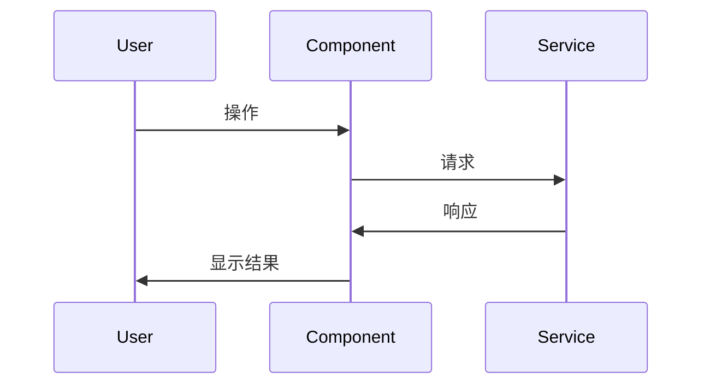

# 键盘快捷键 - 设计文档

> 使用规则驱动开发的AI工作流编写的设计文档

---

## 基本信息

| 项目 | 内容 |
|------|------|
| **功能名称** | 键盘快捷键 |
| **版本** | v1.0.0 |
| **创建日期** | 2026-03-21 |

---

## 架构设计

### 1.1 模块结构

```
modules/键盘快捷键/
├── core/
├── components/
└── utils/
```

### 1.2 类设计

主要类和接口设计。

---

## UI设计

### 2.1 界面元素

功能的主要界面设计。

### 2.2 布局位置

功能在页面中的位置和布局。

---

## 数据结构

### 3.1 状态管理

```javascript
const state = {
  // 状态定义
};
```

---

## 交互流程



---

## 相关文档

- [需求文档](./01-需求文档.md)
- [开发文档](./03-开发文档.md)
- [测试报告](./04-测试报告.md)

---

**规则驱动开发AI工作流元素:**
- **架构设计规则:** 采用模块化设计，确保组件独立性
- **接口设计规则:** 定义清晰的模块接口，便于测试和维护
- **可维护性规则:** 保持架构设计的可扩展性和可维护性
