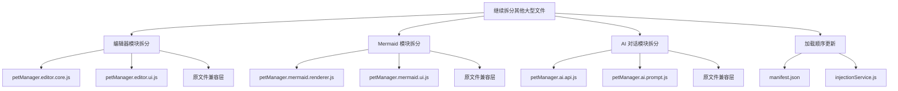
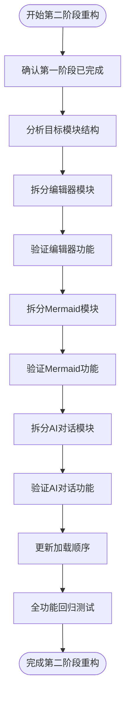
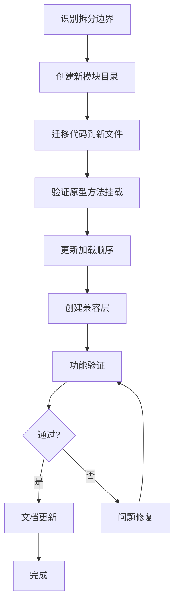
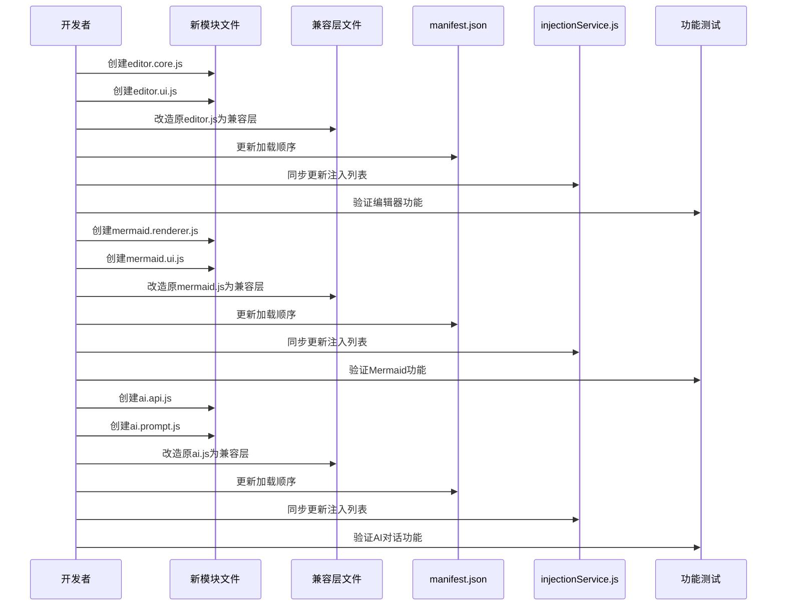

# 继续拆分其他大型文件

> **文档版本**: v1.0 | **最后更新**: 2026-04-29 | **维护者**: doubao-seed-2-0-code-preview-260215 | **工具**: Claude Code
>
> **关联文档**: [需求文档](../01_需求文档/继续拆分其他大型文件.md) | [设计文档](../03_设计文档/继续拆分其他大型文件.md) | [使用文档](../04_使用文档/继续拆分其他大型文件.md)
>

[功能概述](#功能概述) | [功能分析](#功能分析) | [用户故事](#用户故事) | [主要操作场景](#主要操作场景) | [影响分析](#影响分析) | [功能详情](#功能详情) | [验收标准](#验收标准) | [使用场景示例](#使用场景示例)

---

## 功能概述

本需求任务详细描述第二阶段大型文件拆分的具体实施计划。沿用第一阶段已验证的兼容层策略，继续拆分编辑器模块、Mermaid 模块、AI 对话模块等，确保代码质量稳步提升的同时保持功能稳定。

🎯 **问题驱动**：基于文件大小分析结果，针对性拆分超过 1500 行的模块
⚡ **渐进式重构**：沿用兼容层策略，每个模块独立验证
📖 **文档先行**：完整的需求、设计和检查清单确保重构质量

## 功能分析

### 功能分解图

**说明**：三大核心模块拆分，每个模块采用"新模块+兼容层"模式。

### 用户流程图

**说明**：每个模块独立拆分、独立验证，降低整体风险。

### 功能流程图

**说明**：每个模块遵循统一的拆分流程。

### 完整时序图

**说明**：每个模块拆分后立即验证，确保功能稳定。

## 用户故事表格

| 用户故事 | 验收标准 | 过程生成文档 | 产出智能文档 |
|----------|----------|--------|----------|
| 🔴 作为项目维护者，我要继续拆分剩余的超大型模块，以便代码结构更清晰、维护成本更低  **主要操作场景**： - 拆分 petManager.editor.js（2154 行）为核心逻辑和 UI 组件 - 拆分 petManager.mermaid.js（1871 行）为渲染器和交互模块 - 拆分 petManager.ai.js（1608 行）为 API 封装和提示词管理 - 评估并拆分其他超过 1000 行的模块 | 1. 成功拆分所有目标模块，每个新文件不超过 500 行 2. 所有现有功能在重构后继续正常工作 3. 保持与第一阶段重构相同的架构风格 4. 更新 manifest.json 加载顺序确保兼容层正确工作 | [继续拆分其他大型文件](../02_需求任务/继续拆分其他大型文件.md) [继续拆分其他大型文件](../03_设计文档/继续拆分其他大型文件.md) [项目报告](../07_项目报告/继续拆分其他大型文件.md) | [生成文档 Skill](../../.claude/skills/generate-document/SKILL.md) [需求文档规范](../../.claude/skills/generate-document/rules/需求任务.md) [需求文档模板](../../.claude/skills/generate-document/templates/需求任务.md) [需求文档检查清单](../../.claude/skills/generate-document/checklists/需求任务.md) |

## 主要操作场景定义

### 🎯 主要操作场景：编辑器模块拆分

**场景描述**：将 petManager.editor.js（2154 行）拆分为核心逻辑和 UI 交互两个模块

**前置条件**：
1. 第一阶段重构已完成且验证通过
2. 已分析 petManager.editor.js 的代码结构
3. 已确定合理的模块边界（核心逻辑 vs UI 交互）

**操作步骤**：
1. 创建 modules/pet/content/editor/ 目录
2. 分析原文件代码，按职责划分：核心逻辑（数据处理、解析）、UI 交互（DOM 操作、事件监听）
3. 创建 petManager.editor.core.js，迁移核心逻辑方法
4. 创建 petManager.editor.ui.js，迁移 UI 交互方法
5. 将原 petManager.editor.js 改造为兼容层（空实现或日志提示）
6. 更新 manifest.json，在原文件前加载两个新文件
7. 同步更新 injectionService.js 中的文件列表
8. 手动验证编辑器功能（上下文编辑器、会话信息编辑、Markdown 预览）

**预期结果**：
1. 编辑器所有功能继续正常工作
2. 新文件各自不超过 800 行
3. 代码职责更清晰，核心逻辑与 UI 分离
4. 无控制台错误或异常行为

**验证关注点**：
- 上下文编辑器打开/关闭正常
- Markdown 预览功能正常
- 会话信息编辑功能正常
- 智能优化功能正常
- 无 JS 错误在控制台

**相关设计文档章节**：[设计文档-修复内容](../03_设计文档/继续拆分其他大型文件.md#修复内容)

### 🎯 主要操作场景：Mermaid 模块拆分

**场景描述**：将 petManager.mermaid.js（1871 行）拆分为渲染器和 UI 交互两个模块

**前置条件**：
1. 编辑器模块拆分已完成且验证通过
2. 已分析 petManager.mermaid.js 的代码结构
3. 已确定合理的模块边界（渲染核心 vs UI 交互）

**操作步骤**：
1. 创建 modules/pet/content/mermaid/ 目录
2. 分析原文件代码，按职责划分：渲染核心（CDN 加载、图表渲染）、UI 交互（预览、编辑）
3. 创建 petManager.mermaid.renderer.js，迁移渲染核心方法
4. 创建 petManager.mermaid.ui.js，迁移 UI 交互方法
5. 将原 petManager.mermaid.js 改造为兼容层
6. 更新 manifest.json，在原文件前加载两个新文件
7. 同步更新 injectionService.js 中的文件列表
8. 手动验证 Mermaid 功能（图表渲染、预览、编辑）

**预期结果**：
1. Mermaid 所有功能继续正常工作
2. 新文件各自不超过 700 行
3. 渲染逻辑与 UI 交互分离
4. 无控制台错误或异常行为

**验证关注点**：
- Mermaid CDN 加载正常
- 流程图、时序图等渲染正常
- 预览弹窗功能正常
- 无 JS 错误在控制台

**相关设计文档章节**：[设计文档-修复内容](../03_设计文档/继续拆分其他大型文件.md#修复内容)

### 🎯 主要操作场景：AI 对话模块拆分

**场景描述**：将 petManager.ai.js（1608 行）拆分为 API 封装和提示词管理两个模块

**前置条件**：
1. Mermaid 模块拆分已完成且验证通过
2. 已分析 petManager.ai.js 的代码结构
3. 已确定合理的模块边界（API 封装 vs 提示词管理）

**操作步骤**：
1. 创建 modules/pet/content/ai/ 目录
2. 分析原文件代码，按职责划分：API 封装（请求、重试、流式处理）、提示词管理（角色配置、系统提示词）
3. 创建 petManager.ai.api.js，迁移 API 相关方法
4. 创建 petManager.ai.prompt.js，迁移提示词管理方法
5. 将原 petManager.ai.js 改造为兼容层
6. 更新 manifest.json，在原文件前加载两个新文件
7. 同步更新 injectionService.js 中的文件列表
8. 手动验证 AI 对话功能（设置、对话、流式响应）

**预期结果**：
1. AI 对话所有功能继续正常工作
2. 新文件各自不超过 600 行
3. API 逻辑与业务逻辑分离
4. 无控制台错误或异常行为

**验证关注点**：
- AI 设置弹窗正常
- 模型选择正常
- 流式响应正常
- 角色配置功能正常
- 无 JS 错误在控制台

**相关设计文档章节**：[设计文档-修复内容](../03_设计文档/继续拆分其他大型文件.md#修复内容)

## 影响分析

### 执行步骤

1. **读取共享契约**：已读取 `../../.claude/shared/impact-analysis-contract.md`
2. **确定核心标识符**：从文件大小分析和代码扫描中提取关键文件和模块
3. **按契约全项目搜索**：对每个关键标识符执行全项目搜索
4. **追踪依赖链闭合**：分析每个命中点的上下游依赖
5. **标注处置方式**：确定每个改动的处置策略

### 搜索词与改动点清单

| 改动点 | 类型 | 搜索词 | 来源 | 备注 |
|--------|------|--------|------|------|
| petManager.editor.js | file | petManager.editor, editor | 文件大小分析:2154行 | 超大型文件，需要拆分 |
| petManager.mermaid.js | file | petManager.mermaid, mermaid | 文件大小分析:1871行 | 超大型文件，需要拆分 |
| petManager.ai.js | file | petManager.ai, aiApi, ai | 文件大小分析:1608行 | 超大型文件，需要拆分 |
| manifest.json | config | manifest.json, content_scripts | manifest.json | 需要更新加载顺序 |
| injectionService.js | config | injectionService.js, CONTENT_SCRIPT_FILES | modules/extension/background/services/injectionService.js | 需要同步更新注入列表 |

### 改动点影响链

| 改动点 | 搜索词 | 命中文件 | 引用方式 | 影响层级 | 依赖方向 | 处置方式 | 闭合状态 | 说明 |
|--------|--------|---------|---------|---------|----------|--------|------|
| petManager.editor.js | petManager.editor.js | manifest.json:41 | content_script | 直接 | 反向依赖 | 同步修改 | 已闭合 | 需要更新加载顺序，追加新文件 |
| petManager.editor.js | petManager.editor.js | modules/extension/background/services/injectionService.js:40 | 数组元素 | 直接 | 反向依赖 | 同步修改 | 已闭合 | 需要同步更新注入列表 |
| petManager.mermaid.js | petManager.mermaid.js | manifest.json:42 | content_script | 直接 | 反向依赖 | 同步修改 | 已闭合 | 需要更新加载顺序，追加新文件 |
| petManager.mermaid.js | petManager.mermaid.js | modules/extension/background/services/injectionService.js:41 | 数组元素 | 直接 | 反向依赖 | 同步修改 | 已闭合 | 需要同步更新注入列表 |
| petManager.ai.js | petManager.ai.js | manifest.json:39 | content_script | 直接 | 反向依赖 | 同步修改 | 已闭合 | 需要更新加载顺序，追加新文件 |
| petManager.ai.js | petManager.ai.js | modules/extension/background/services/injectionService.js:38 | 数组元素 | 直接 | 反向依赖 | 同步修改 | 已闭合 | 需要同步更新注入列表 |
| manifest.json | content_scripts | manifest.json:14-88 | 配置项 | 直接 | 反向依赖 | 同步修改 | 已闭合 | 插入新文件到正确位置 |
| injectionService.js | CONTENT_SCRIPT_FILES | modules/extension/background/services/injectionService.js:12-70 | 常量数组 | 直接 | 反向依赖 | 同步修改 | 已闭合 | 与 manifest.json 保持一致 |

### 依赖闭合摘要

| 改动点 | 上游依赖是否核对 | 反向依赖是否核对 | 传递依赖是否闭合 | 测试 / 文档 / 配置是否覆盖 | 结论 |
|--------|------------------|------------------|------------------|----------------------------|------|
| petManager.editor.js 拆分 | 是 | 是 | 是 | 是 | 可实施（兼容层策略） |
| petManager.mermaid.js 拆分 | 是 | 是 | 是 | 是 | 可实施（兼容层策略） |
| petManager.ai.js 拆分 | 是 | 是 | 是 | 是 | 可实施（兼容层策略） |
| manifest.json 更新 | 是 | 是 | 是 | 是 | 可实施（追加新文件） |
| injectionService.js 更新 | 是 | 是 | 是 | 是 | 可实施（同步更新） |

### 未覆盖风险

| 风险来源 | 原因 | 影响 | 缓解方式 |
|----------|------|------|----------|
| 动态字符串引用 | 代码中可能存在通过字符串拼接的方法引用 | 兼容层可能覆盖不全 | 重构后进行全面的手动测试，重点检查边缘功能 |
| 外部依赖未知 | 不清楚是否有其他代码依赖这些文件的内部结构 | 重构可能破坏未知依赖 | 保持文件存在作为兼容层，不删除原文件 |
| 浏览器扩展更新 | 扩展更新时可能存在旧版本缓存问题 | 用户可能遇到混合版本问题 | 保持向后兼容，兼容层至少保留一个版本周期 |
| 测试覆盖不足 | 现有代码库缺乏自动化测试 | 重构可能引入回归问题 | 实施后进行全面的手动回归测试，覆盖主要功能 |

### 改动范围汇总

- **需直接修改的文件数**：8 文件（3 原文件改造 + 6 新文件 + 2 配置更新）
- **需验证兼容性的文件数**：20+ 个相关文件（所有使用这些模块的功能）
- **需追踪传递影响的文件数**：整个代码库
- **需人工复核或阻断的风险**：动态字符串引用风险，建议全面测试后再完全移除兼容层

## 功能详情

### 编辑器模块拆分

**功能说明**：将 petManager.editor.js 拆分为核心逻辑和 UI 交互两个模块
**价值**：编辑器核心功能与 UI 展示分离，便于独立维护和测试
**解决的痛点**：单个文件包含所有编辑器相关代码，职责不清
**收益**：代码结构更清晰，核心逻辑变更不影响 UI，反之亦然

### Mermaid 模块拆分

**功能说明**：将 petManager.mermaid.js 拆分为渲染器和 UI 交互两个模块
**价值**：Mermaid 核心渲染逻辑与 UI 交互分离
**解决的痛点**：CDN 加载、渲染逻辑、预览功能混杂在同一文件中
**收益**：渲染逻辑稳定，UI 交互可独立迭代，降低改动风险

### AI 对话模块拆分

**功能说明**：将 petManager.ai.js 拆分为 API 封装和提示词管理两个模块
**价值**：AI API 调用逻辑与提示词业务逻辑分离
**解决的痛点**：重试机制、token 管理、角色配置混杂在一起
**收益**：API 层可独立优化，业务层可独立迭代，职责更清晰

### 加载顺序同步

**功能说明**：同步更新 manifest.json 和 injectionService.js 中的文件加载顺序
**价值**：确保新模块先加载，兼容层后加载
**解决的痛点**：依赖关系导致初始化错误
**收益**：两个配置文件保持一致，降低维护成本

## 验收标准

### P0 - 必须通过

- **目标模块拆分完整**：成功拆分 petManager.editor.js、petManager.mermaid.js、petManager.ai.js
- **功能保持兼容**：所有现有功能在重构后无回归问题
- **架构一致性**：与第一阶段重构的模块划分风格保持一致
- **加载顺序正确**：manifest.json 和 injectionService.js 中的加载顺序确保兼容层正常工作
- **影响分析完整**：所有改动点的影响链已分析并记录

### P1 - 应该通过

- **代码质量提升**：拆分后的代码职责更清晰、耦合度更低
- **文档同步更新**：相关模块文档（如存在）同步更新
- **验证充分**：主要操作场景都经过手动验证
- **错误处理统一**：保持原有的错误处理和日志记录

### P2 - 可以有

- **最佳实践落地**：重构后的代码遵循项目编码规范
- **可测试性提升**：代码结构更便于单元测试
- **注释完善**：关键逻辑有清晰的注释说明

## 使用场景示例

### 📋 场景 1：编辑器模块拆分

**背景**：petManager.editor.js 包含上下文编辑器、会话信息编辑器、Markdown 预览等所有功能，共 2154 行
**操作**：
1. 拆分为 petManager.editor.core.js（编辑器核心逻辑、数据处理）
2. 拆分为 petManager.editor.ui.js（UI 交互、事件监听）
3. 保留原文件作为兼容层
**结果**：代码职责清晰，后续可独立优化渲染或交互逻辑

### 🎨 场景 2：Mermaid 模块拆分

**背景**：petManager.mermaid.js 包含 CDN 加载、图表渲染、预览交互等所有功能，共 1871 行
**操作**：
1. 拆分为 petManager.mermaid.renderer.js（CDN 加载、渲染核心）
2. 拆分为 petManager.mermaid.ui.js（预览弹窗、交互处理）
3. 保留原文件作为兼容层
**结果**：渲染逻辑稳定，UI 交互可独立迭代
