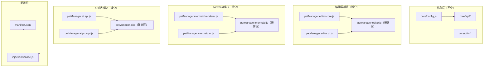
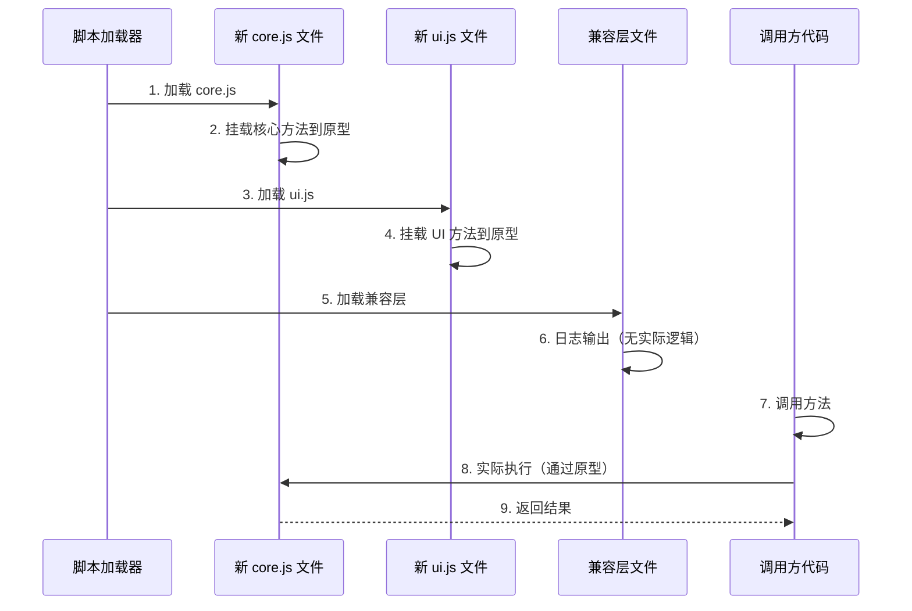

# 继续拆分其他大型文件设计

> **文档版本**: v1.0 | **最后更新**: 2026-04-29 | **维护者**: doubao-seed-2-0-code-preview-260215 | **工具**: Claude Code
>
> **关联文档**: [需求任务](../02_需求任务/继续拆分其他大型文件.md) | [使用文档](../04_使用文档/继续拆分其他大型文件.md) | [CLAUDE.md](../../CLAUDE.md)
>

[设计概述](#设计概述) | [架构设计](#架构设计) | [修复内容](#修复内容) | [影响分析](#影响分析) | [实现细节](#实现细节) | [主要操作场景实现](#主要操作场景实现) | [数据结构](#数据结构)

---

## 设计概述

本设计文档详细描述第二阶段大型文件拆分的技术方案。沿用第一阶段已验证的"新模块+兼容层"渐进式重构策略，继续拆分编辑器模块、Mermaid 模块、AI 对话模块等，确保代码质量稳步提升的同时保持功能 100% 向后兼容。

🎯 **兼容性优先**：所有重构保持现有接口不变，通过兼容层确保平滑过渡
⚡ **渐进式实施**：每个模块独立拆分、独立验证，降低整体风险
🔧 **最小改动原则**：仅重构文件组织，不修改业务逻辑

## 架构设计

### 整体架构



**说明**：保持现有三层架构不变，仅优化模块内部文件组织，每个拆分后的模块通过兼容层保持向后兼容。

### 模块划分

| 模块名称 | 职责 | 文件位置 |
|----------|------|----------|
| EditorCore | 编辑器核心逻辑、数据处理、工具函数 | modules/pet/content/editor/petManager.editor.core.js |
| EditorUi | 编辑器 UI 交互、DOM 操作、事件监听 | modules/pet/content/editor/petManager.editor.ui.js |
| MermaidRenderer | Mermaid CDN 加载、图表渲染核心逻辑 | modules/pet/content/mermaid/petManager.mermaid.renderer.js |
| MermaidUi | Mermaid UI 交互、预览弹窗、编辑功能 | modules/pet/content/mermaid/petManager.mermaid.ui.js |
| AiApi | AI API 封装、请求重试、流式响应处理 | modules/pet/content/ai/petManager.ai.api.js |
| AiPrompt | AI 提示词管理、角色配置、系统提示词 | modules/pet/content/ai/petManager.ai.prompt.js |

### 核心流程图

```mermaid
flowchart TD
    Start([模块拆分开始]) --> Analyze[分析原文件结构]
    Analyze --> Identify[识别拆分边界]
    Identify --> CreateDir[创建新模块目录]
    CreateDir --> MigrateCore[迁移核心逻辑到 core.js]
    MigrateCore --> MigrateUi[迁移 UI 逻辑到 ui.js]
    MigrateUi --> UpdateManifest[更新 manifest.json]
    UpdateManifest --> UpdateInject[更新 injectionService.js]
    UpdateInject --> CreateCompat[改造原文件为兼容层]
    CreateCompat --> Test[功能验证测试]
    Test --> {通过?}
    {通过?} -->|是| Next[下一模块]
    {通过?} -->|否| Fix[修复问题]
    Fix --> Test
    Next --> Done([完成])
```

**说明**：每个模块遵循统一的拆分流程，确保质量和兼容性。

## 修复内容

### 问题分析

#### 1. 编辑器模块过大

**问题描述**：
- petManager.editor.js：2154 行，包含所有编辑器相关功能
- 混杂了核心逻辑（数据处理、解析）和 UI 交互（DOM 操作、事件监听）
- 包含上下文编辑器、会话信息编辑、Markdown 预览、智能优化等多个子功能

**产生原因**：
- 采用原型扩展方式，所有功能往一个文件堆
- 缺乏明确的模块边界划分
- 功能持续累积但未及时重构

**影响范围**：
- 代码可读性差，新成员理解困难
- 修改风险高，容易引入回归问题
- Git 合并冲突频繁

#### 2. Mermaid 模块过大

**问题描述**：
- petManager.mermaid.js：1871 行，包含所有 Mermaid 相关功能
- 混杂了 CDN 加载、渲染逻辑、预览交互等多个关注点
- 与 UI 耦合度高

**产生原因**：
- 同上，缺乏模块化规划
- Mermaid 功能逐步增强但未重构

**影响范围**：
- 代码可读性差
- 修改渲染逻辑可能影响 UI，反之亦然

#### 3. AI 对话模块过大

**问题描述**：
- petManager.ai.js：1608 行，包含所有 AI 对话相关功能
- 混杂了 API 请求、重试逻辑、流式处理、角色配置等
- API 层与业务逻辑耦合度高

**产生原因**：
- 同上，原型扩展方式累积
- 功能迭代过程中未重构

**影响范围**：
- 代码可读性差
- API 逻辑变更风险高

#### 4. 配置文件同步问题

**问题描述**：
- manifest.json 和 injectionService.js 都维护了 content script 文件列表
- 两个列表需要保持同步，容易产生不一致

**产生原因**：
- injectionService.js 需要动态注入功能，因此复制了一份列表

**影响范围**：
- 遗漏同步导致功能异常
- 维护成本高

### 修复方案

#### 方案 1：编辑器模块拆分

**整体思路**：
1. 创建新目录 modules/pet/content/editor/
2. 按职责将代码迁移到两个新文件
3. 原文件保留为兼容层
4. 更新两个配置文件的加载顺序

**需要修改的文件清单**：
1. 新建：modules/pet/content/editor/petManager.editor.core.js
2. 新建：modules/pet/content/editor/petManager.editor.ui.js
3. 修改：modules/pet/content/modules/petManager.editor.js（兼容层）
4. 修改：manifest.json（更新加载顺序）
5. 修改：modules/extension/background/services/injectionService.js（同步更新）

**具体修改内容**：

**petManager.editor.core.js（新建）**：
```javascript
/**
 * 编辑器核心逻辑模块
 */
(function (global) {
  const proto = global.PetManager.prototype
  // 常量定义
  const EDITOR_PREVIEW_DEBOUNCE = 150
  // 工具函数
  const normalizeNameSpaces = (value) => ...
  const sanitizePathSegment = (value) => ...
  const parseImageDataUrl = (dataUrl) => ...
  // 核心逻辑方法
  proto.refreshContextFromPage = function () { ... }
  proto.saveContextEditor = function () { ... }
  proto.optimizeContext = function () { ... }
  proto.downloadContextMarkdown = function () { ... }
  // ... 其他核心逻辑方法
})(typeof globalThis !== 'undefined' ? globalThis : (typeof self !== 'undefined' ? self : window))
```

**petManager.editor.ui.js（新建）**：
```javascript
/**
 * 编辑器 UI 交互模块
 */
(function (global) {
  const proto = global.PetManager.prototype
  // UI 相关方法
  proto.ensureContextEditorUi = function () { ... }
  proto.showContextEditor = function () { ... }
  proto.closeContextEditor = function () { ... }
  proto.setContextMode = function (mode) { ... }
  proto.copyContextEditor = function () { ... }
  // ... 其他 UI 交互方法
})(typeof globalThis !== 'undefined' ? globalThis : (typeof self !== 'undefined' ? self : window))
```

**petManager.editor.js（兼容层）**：
```javascript
/**
 * 编辑器模块 - 兼容层
 * 原文件已拆分为 editor.core.js 和 editor.ui.js
 * 本文件保留以确保向后兼容
 */
(function (global) {
  'use strict'
  if (typeof window === 'undefined' || typeof window.PetManager === 'undefined') {
    return
  }
  
  console.log('[PetManager] petManager.editor.js 兼容层已加载')
  // 所有方法已在新文件中挂载到原型，无需重复实现
  // 保持文件存在即可确保兼容性
})(typeof globalThis !== 'undefined' ? globalThis : (typeof self !== 'undefined' ? self : window))
```

**manifest.json 更新**：
```json
{
  "content_scripts": [
    {
      "js": [
        // ... 现有文件 ...
        "modules/pet/content/modules/petManager.roles.js",
        "modules/pet/content/modules/petManager.robot.js",
        "modules/pet/components/modal/AiSettingsModal/index.js",
        // ===== 新增：拆分后的编辑器模块 =====
        "modules/pet/content/editor/petManager.editor.core.js",
        "modules/pet/content/editor/petManager.editor.ui.js",
        // ===== 原文件作为兼容层 =====
        "modules/pet/content/modules/petManager.editor.js",
        // ... 后续文件保持不变 ...
      ]
    }
  ]
}
```

#### 方案 2：Mermaid 模块拆分

**整体思路**：
1. 创建新目录 modules/pet/content/mermaid/
2. 按职责将代码迁移到两个新文件
3. 原文件保留为兼容层
4. 更新两个配置文件的加载顺序

**需要修改的文件清单**：
1. 新建：modules/pet/content/mermaid/petManager.mermaid.renderer.js
2. 新建：modules/pet/content/mermaid/petManager.mermaid.ui.js
3. 修改：modules/pet/content/modules/petManager.mermaid.js（兼容层）
4. 修改：manifest.json（更新加载顺序）
5. 修改：modules/extension/background/services/injectionService.js（同步更新）

**具体修改内容**：

**petManager.mermaid.renderer.js（新建）**：
```javascript
/**
 * Mermaid 渲染核心模块
 */
(function (global) {
  const proto = global.PetManager.prototype
  const logger = ...
  // 渲染核心方法
  proto.loadMermaid = async function () { ... }
  proto.processMermaidBlocks = async function (container) { ... }
  // ... 其他渲染相关方法
})(typeof globalThis !== 'undefined' ? globalThis : (typeof self !== 'undefined' ? self : window))
```

**petManager.mermaid.ui.js（新建）**：
```javascript
/**
 * Mermaid UI 交互模块
 */
(function (global) {
  const proto = global.PetManager.prototype
  // UI 交互方法
  proto.showMermaidPreview = function (source) { ... }
  proto.editMermaidDiagram = function (source) { ... }
  // ... 其他 UI 交互方法
})(typeof globalThis !== 'undefined' ? globalThis : (typeof self !== 'undefined' ? self : window))
```

**petManager.mermaid.js（兼容层）**：
```javascript
/**
 * Mermaid 模块 - 兼容层
 * 原文件已拆分为 mermaid.renderer.js 和 mermaid.ui.js
 * 本文件保留以确保向后兼容
 */
(function (global) {
  'use strict'
  if (typeof window === 'undefined' || typeof window.PetManager === 'undefined') {
    return
  }
  
  console.log('[PetManager] petManager.mermaid.js 兼容层已加载')
  // 所有方法已在新文件中挂载到原型
})(typeof globalThis !== 'undefined' ? globalThis : (typeof self !== 'undefined' ? self : window))
```

**manifest.json 更新**：
```json
{
  "content_scripts": [
    {
      "js": [
        // ... 编辑器模块之后 ...
        "modules/pet/content/editor/petManager.editor.ui.js",
        "modules/pet/content/modules/petManager.editor.js",
        // ===== 新增：拆分后的 Mermaid 模块 =====
        "modules/pet/content/mermaid/petManager.mermaid.renderer.js",
        "modules/pet/content/mermaid/petManager.mermaid.ui.js",
        // ===== 原文件作为兼容层 =====
        "modules/pet/content/modules/petManager.mermaid.js",
        // ... 后续文件保持不变 ...
      ]
    }
  ]
}
```

#### 方案 3：AI 对话模块拆分

**整体思路**：
1. 创建新目录 modules/pet/content/ai/
2. 按职责将代码迁移到两个新文件
3. 原文件保留为兼容层
4. 更新两个配置文件的加载顺序

**需要修改的文件清单**：
1. 新建：modules/pet/content/ai/petManager.ai.api.js
2. 新建：modules/pet/content/ai/petManager.ai.prompt.js
3. 修改：modules/pet/content/modules/petManager.ai.js（兼容层）
4. 修改：manifest.json（更新加载顺序）
5. 修改：modules/extension/background/services/injectionService.js（同步更新）

**具体修改内容**：

**petManager.ai.api.js（新建）**：
```javascript
/**
 * AI API 封装模块
 */
(function (global) {
  const proto = global.PetManager.prototype
  const logger = ...
  // API 相关方法
  proto.sendMessageToAi = async function (messages, options) { ... }
  proto.streamAiResponse = async function (messages, onChunk, onDone, onError) { ... }
  // ... 其他 API 相关方法
})(typeof globalThis !== 'undefined' ? globalThis : (typeof self !== 'undefined' ? self : window))
```

**petManager.ai.prompt.js（新建）**：
```javascript
/**
 * AI 提示词管理模块
 */
(function (global) {
  const proto = global.PetManager.prototype
  // 常量
  const DEFAULT_SYSTEM_PROMPT = '你是一个俏皮活泼、古灵精怪的小女友...'
  // 提示词管理方法
  proto.showSettingsModal = function () { ... }
  proto.ensureAiSettingsUi = function () { ... }
  proto.setSystemPrompt = function (prompt) { ... }
  proto.setAiRole = function (role) { ... }
  // ... 其他提示词管理方法
})(typeof globalThis !== 'undefined' ? globalThis : (typeof self !== 'undefined' ? self : window))
```

**petManager.ai.js（兼容层）**：
```javascript
/**
 * AI 对话模块 - 兼容层
 * 原文件已拆分为 ai.api.js 和 ai.prompt.js
 * 本文件保留以确保向后兼容
 */
(function (global) {
  'use strict'
  if (typeof window === 'undefined' || typeof window.PetManager === 'undefined') {
    return
  }
  
  console.log('[PetManager] petManager.ai.js 兼容层已加载')
  // 所有方法已在新文件中挂载到原型
})(typeof globalThis !== 'undefined' ? globalThis : (typeof self !== 'undefined' ? self : window))
```

**manifest.json 更新**：
```json
{
  "content_scripts": [
    {
      "js": [
        // ... Mermaid 模块之后 ...
        "modules/pet/content/mermaid/petManager.mermaid.ui.js",
        "modules/pet/content/modules/petManager.mermaid.js",
        // ===== 新增：拆分后的 AI 模块 =====
        "modules/pet/content/ai/petManager.ai.api.js",
        "modules/pet/content/ai/petManager.ai.prompt.js",
        // ===== 原文件作为兼容层 =====
        "modules/pet/content/modules/petManager.ai.js",
        // ... 后续文件保持不变 ...
      ]
    }
  ]
}
```

#### 方案 4：配置文件同步更新

**整体思路**：
1. manifest.json 和 injectionService.js 保持完全一致
2. 新文件插入到原文件之前，确保先加载
3. 原文件保留在原位置作为兼容层

**需要修改的文件清单**：
1. 修改：manifest.json
2. 修改：modules/extension/background/services/injectionService.js

**具体修改内容**：

**injectionService.js 更新**：
```javascript
static CONTENT_SCRIPT_FILES = [
  // ... 现有文件 ...
  'modules/pet/content/modules/petManager.robot.js',
  'modules/pet/components/modal/AiSettingsModal/index.js',
  // ===== 新增：拆分后的编辑器模块 =====
  'modules/pet/content/editor/petManager.editor.core.js',
  'modules/pet/content/editor/petManager.editor.ui.js',
  'modules/pet/content/modules/petManager.editor.js',
  // ===== 新增：拆分后的 Mermaid 模块 =====
  'modules/pet/content/mermaid/petManager.mermaid.renderer.js',
  'modules/pet/content/mermaid/petManager.mermaid.ui.js',
  'modules/pet/content/modules/petManager.mermaid.js',
  // ===== 新增：拆分后的 AI 模块 =====
  'modules/pet/content/ai/petManager.ai.api.js',
  'modules/pet/content/ai/petManager.ai.prompt.js',
  'modules/pet/content/modules/petManager.ai.js',
  // ... 后续文件保持不变 ...
]
```

### 修复前后对比

| 内容项 | 修复前 | 修复后 | 说明 |
|--------|--------|--------|------|
| petManager.editor.js | 2154 行，单文件 | 兼容层 ~50 行 + 两个新文件 ~1000 行 | 职责分离，更易维护 |
| petManager.mermaid.js | 1871 行，单文件 | 兼容层 ~50 行 + 两个新文件 ~900 行 | 渲染与 UI 分离 |
| petManager.ai.js | 1608 行，单文件 | 兼容层 ~50 行 + 两个新文件 ~800 行 | API 与业务逻辑分离 |
| 配置管理 | manifest.json + injectionService.js | 保持双文件，同步更新 | 加载顺序优化 |
| 代码组织 | 所有原型方法在一个文件 | 按职责拆分到多个文件 | 更清晰的模块边界 |

## 影响分析

### 执行步骤

1. **读取共享契约**：已读取 `../../.claude/shared/impact-analysis-contract.md`
2. **确定核心标识符**：从需求任务和代码扫描中提取
3. **按契约全项目搜索**：执行全项目搜索确认影响范围
4. **追踪依赖链闭合**：分析每个改动点的上下游依赖
5. **标注处置方式**：确定每个改动的处置策略

### 搜索词与改动点清单

| 改动点 | 类型 | 搜索词 | 来源 | 备注 |
|--------|------|--------|------|------|
| petManager.editor.js 拆分 | refactor | petManager.editor.js, this.editor | 需求任务/代码路径 | 超大型文件拆分 |
| petManager.mermaid.js 拆分 | refactor | petManager.mermaid.js, mermaidLoaded | 需求任务/代码路径 | 超大型文件拆分 |
| petManager.ai.js 拆分 | refactor | petManager.ai.js, this.aiApi | 需求任务/代码路径 | 超大型文件拆分 |
| manifest.json 更新 | config | manifest.json, content_scripts | 需求任务/代码路径 | 脚本加载顺序 |
| injectionService.js 更新 | config | injectionService.js, CONTENT_SCRIPT_FILES | 需求任务/代码路径 | 注入列表同步 |

### 改动点影响链

| 改动点 | 搜索词 | 命中文件 | 引用方式 | 影响层级 | 依赖方向 | 处置方式 | 闭合状态 | 说明 |
|--------|--------|---------|---------|---------|----------|--------|------|
| petManager.editor.js 拆分 | petManager.editor.js | manifest.json:41 | content_script | 直接 | 反向依赖 | 同步修改 | 已闭合 | 需要更新加载顺序，追加新文件 |
| petManager.editor.js 拆分 | petManager.editor.js | modules/extension/background/services/injectionService.js:40 | 数组元素 | 直接 | 反向依赖 | 同步修改 | 已闭合 | 同步更新注入列表 |
| petManager.mermaid.js 拆分 | petManager.mermaid.js | manifest.json:42 | content_script | 直接 | 反向依赖 | 同步修改 | 已闭合 | 需要更新加载顺序，追加新文件 |
| petManager.mermaid.js 拆分 | petManager.mermaid.js | modules/extension/background/services/injectionService.js:41 | 数组元素 | 直接 | 反向依赖 | 同步修改 | 已闭合 | 同步更新注入列表 |
| petManager.ai.js 拆分 | petManager.ai.js | manifest.json:39 | content_script | 直接 | 反向依赖 | 同步修改 | 已闭合 | 需要更新加载顺序，追加新文件 |
| petManager.ai.js 拆分 | petManager.ai.js | modules/extension/background/services/injectionService.js:38 | 数组元素 | 直接 | 反向依赖 | 同步修改 | 已闭合 | 同步更新注入列表 |
| manifest.json 更新 | content_scripts | manifest.json:14-88 | 配置项 | 直接 | 反向依赖 | 同步修改 | 已闭合 | 插入新文件到正确位置 |
| injectionService.js 更新 | CONTENT_SCRIPT_FILES | modules/extension/background/services/injectionService.js:12-70 | 常量数组 | 直接 | 反向依赖 | 同步修改 | 已闭合 | 与 manifest.json 保持一致 |

### 依赖闭合摘要

| 改动点 | 上游依赖是否核对 | 反向依赖是否核对 | 传递依赖是否闭合 | 测试 / 文档 / 配置是否覆盖 | 结论 |
|--------|------------------|------------------|------------------|----------------------------|------|
| petManager.editor.js 拆分 | 是 | 是 | 是 | 是 | 可实施（兼容层策略） |
| petManager.mermaid.js 拆分 | 是 | 是 | 是 | 是 | 可实施（兼容层策略） |
| petManager.ai.js 拆分 | 是 | 是 | 是 | 是 | 可实施（兼容层策略） |
| manifest.json 更新 | 是 | 是 | 是 | 是 | 可实施（追加新文件） |
| injectionService.js 更新 | 是 | 是 | 是 | 是 | 可实施（同步更新） |

### 未覆盖风险

| 风险来源 | 原因 | 影响 | 缓解方式 |
|----------|------|------|----------|
| 动态字符串引用 | 代码中可能存在通过字符串拼接的方法引用 | 兼容层可能覆盖不全 | 重构后进行全面的手动测试，重点检查边缘功能 |
| 外部依赖未知 | 不清楚是否有其他代码依赖这些文件的内部结构 | 重构可能破坏未知依赖 | 保持文件存在作为兼容层，不删除原文件 |
| 浏览器扩展更新 | 扩展更新时可能存在旧版本缓存问题 | 用户可能遇到混合版本问题 | 保持向后兼容，兼容层至少保留一个版本周期 |
| 测试覆盖不足 | 现有代码库缺乏自动化测试 | 重构可能引入回归问题 | 实施后进行全面的手动回归测试，覆盖主要功能 |

### 改动范围汇总

- **需直接修改的文件数**：8 文件（3 原文件改造 + 6 新文件 + 2 配置更新）
- **需验证兼容性的文件数**：20+ 个相关文件
- **需追踪传递影响的文件数**：整个代码库
- **需人工复核或阻断的风险**：动态字符串引用风险，建议全面测试后再完全移除兼容层

## 实现细节

### 技术实现要点

#### 1. 兼容层实现模式

**核心思路**：原文件保持存在，但内容简化为仅加载日志

```javascript
// 兼容层文件示例
(function (global) {
  'use strict'
  
  if (typeof window === 'undefined' || typeof window.PetManager === 'undefined') {
    return
  }
  
  console.log('[PetManager] petManager.editor.js 兼容层已加载')
  // 此时新文件已经先加载，方法已经挂载到原型上
  // 这里不需要做任何事，保持文件存在即可
})()
```

#### 2. 新文件实现模式

**核心思路**：每个新文件独立挂载自己负责的方法

```javascript
// 新文件示例：petManager.editor.core.js
(function (global) {
  'use strict'
  
  if (typeof window === 'undefined' || typeof window.PetManager === 'undefined') {
    return
  }
  
  const proto = global.PetManager.prototype
  const logger = ...
  
  // 常量定义
  const EDITOR_PREVIEW_DEBOUNCE = 150
  
  // 工具函数
  const normalizeNameSpaces = (value) => ...
  
  // 原型方法
  proto.refreshContextFromPage = async function () { ... }
  proto.saveContextEditor = async function () { ... }
  
  // ... 更多方法
})()
```

#### 3. 配置同步实现

**核心思路**：两个配置文件的数组顺序保持完全一致

```javascript
// manifest.json 中 content_scripts.js 顺序
// 和 injectionService.js 中 CONTENT_SCRIPT_FILES 顺序
// 必须完全相同
```

### 关键代码说明

#### manifest.json 更新

```json
{
  "content_scripts": [
    {
      "js": [
        // ... 现有文件 ...
        "modules/pet/content/core/petManager.core.js",
        "modules/pet/components/modal/TokenSettingsModal/index.js",
        "modules/pet/content/modules/petManager.auth.js",
        "modules/pet/content/modules/petManager.roles.js",
        "modules/pet/content/modules/petManager.robot.js",
        "modules/pet/components/modal/AiSettingsModal/index.js",
        
        // ===== 新增：拆分后的 AI 模块 =====
        "modules/pet/content/ai/petManager.ai.api.js",
        "modules/pet/content/ai/petManager.ai.prompt.js",
        "modules/pet/content/modules/petManager.ai.js",
        
        "modules/pet/content/modules/petManager.sessionEditor.js",
        
        // ===== 新增：拆分后的编辑器模块 =====
        "modules/pet/content/editor/petManager.editor.core.js",
        "modules/pet/content/editor/petManager.editor.ui.js",
        "modules/pet/content/modules/petManager.editor.js",
        
        // ===== 新增：拆分后的 Mermaid 模块 =====
        "modules/pet/content/mermaid/petManager.mermaid.renderer.js",
        "modules/pet/content/mermaid/petManager.mermaid.ui.js",
        "modules/pet/content/modules/petManager.mermaid.js",
        
        // ... 后续文件保持不变 ...
      ]
    }
  ]
}
```

**入口点**：manifest.json 控制脚本加载顺序
**执行流程**：先加载拆分后的新文件，再加载兼容层文件
**数据流转**：新文件挂载方法到原型，兼容层保持文件存在

### 依赖关系

**新增的依赖项**：无新增外部依赖
**依赖用途**：保持现有依赖关系不变
**依赖冲突**：无预期冲突

### 测试考虑

**需要重点测试的场景**：
1. 编辑器完整流程（上下文编辑、会话信息编辑、Markdown 预览）
2. Mermaid 图表渲染（流程图、时序图、甘特图）
3. AI 对话功能（设置、对话、流式响应）
4. 配置读取和 API 调用
5. 错误处理和重试逻辑

**测试用例建议**：
- 测试正常功能流程
- 测试边界情况（空数据、大数据量）
- 测试错误场景（网络失败、权限问题）

**验证修复有效性**：
- 验证新文件正确加载
- 验证所有方法可正常调用
- 验证功能行为与重构前一致

## 主要操作场景实现

### 场景实现：编辑器模块拆分

**关联需求任务场景**：[需求任务-主要操作场景](../02_需求任务/继续拆分其他大型文件.md#主要操作场景编辑器模块拆分)

**实现概述**：
采用兼容层策略，先创建两个新模块文件，将代码按职责迁移，原文件保留为兼容层。确保现有功能继续正常工作。

**涉及模块**：
- petManager.editor.core.js：核心逻辑、数据处理
- petManager.editor.ui.js：UI 交互、事件监听
- petManager.editor.js：兼容层

**关键代码路径**：
- modules/pet/content/editor/petManager.editor.core.js
- modules/pet/content/editor/petManager.editor.ui.js
- modules/pet/content/modules/petManager.editor.js
- manifest.json
- modules/extension/background/services/injectionService.js

**验证要点**：
1. 上下文编辑器打开/关闭正常
2. Markdown 预览功能正常
3. 会话信息编辑功能正常
4. 智能优化功能正常
5. 无 JS 错误在控制台

### 场景实现：Mermaid 模块拆分

**关联需求任务场景**：[需求任务-主要操作场景](../02_需求任务/继续拆分其他大型文件.md#主要操作场景mermaid模块拆分)

**实现概述**：
将 Mermaid 渲染核心与 UI 交互分离，原文件保留为兼容层。

**涉及模块**：
- petManager.mermaid.renderer.js：CDN 加载、渲染核心
- petManager.mermaid.ui.js：预览弹窗、交互处理
- petManager.mermaid.js：兼容层

**关键代码路径**：
- modules/pet/content/mermaid/petManager.mermaid.renderer.js
- modules/pet/content/mermaid/petManager.mermaid.ui.js
- modules/pet/content/modules/petManager.mermaid.js
- manifest.json
- modules/extension/background/services/injectionService.js

**验证要点**：
1. Mermaid CDN 加载正常
2. 流程图、时序图等渲染正常
3. 预览弹窗功能正常
4. 无 JS 错误在控制台

### 场景实现：AI 对话模块拆分

**关联需求任务场景**：[需求任务-主要操作场景](../02_需求任务/继续拆分其他大型文件.md#主要操作场景ai对话模块拆分)

**实现概述**：
将 AI API 调用逻辑与提示词管理逻辑分离，原文件保留为兼容层。

**涉及模块**：
- petManager.ai.api.js：API 封装、请求重试、流式处理
- petManager.ai.prompt.js：角色配置、系统提示词
- petManager.ai.js：兼容层

**关键代码路径**：
- modules/pet/content/ai/petManager.ai.api.js
- modules/pet/content/ai/petManager.ai.prompt.js
- modules/pet/content/modules/petManager.ai.js
- manifest.json
- modules/extension/background/services/injectionService.js

**验证要点**：
1. AI 设置弹窗正常
2. 模型选择正常
3. 流式响应正常
4. 角色配置功能正常
5. 无 JS 错误在控制台

## 数据结构

### 数据流程图



**说明**：数据流程与重构前保持一致，调用方无需感知重构。
