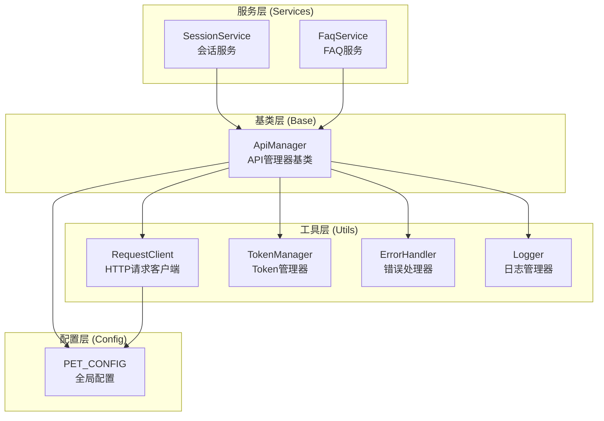
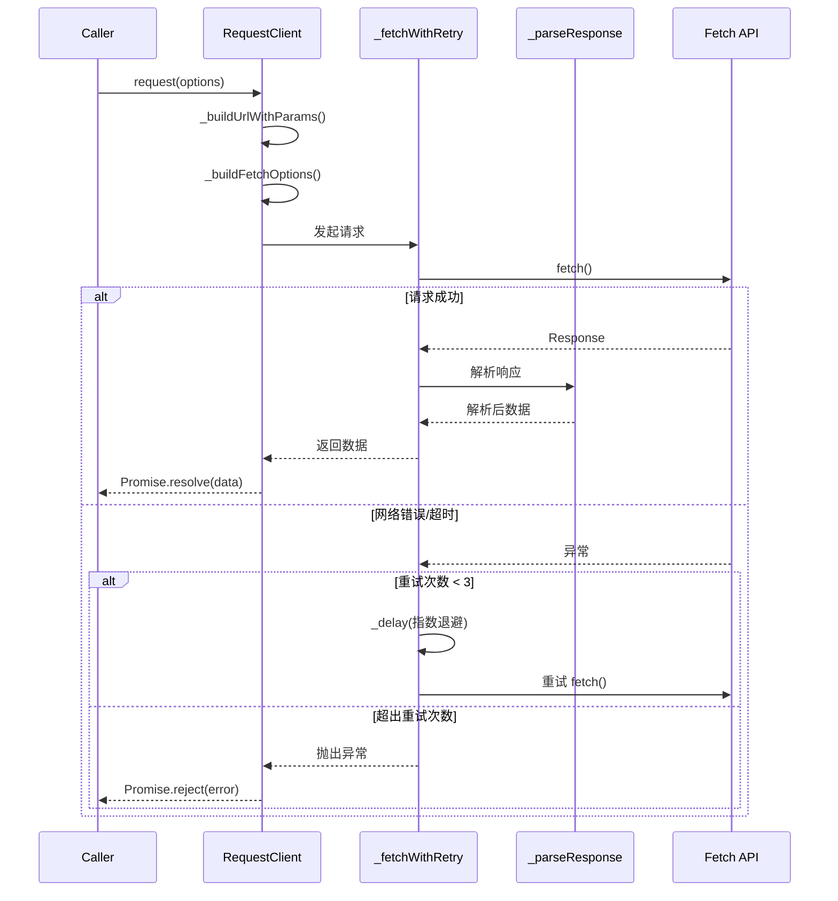
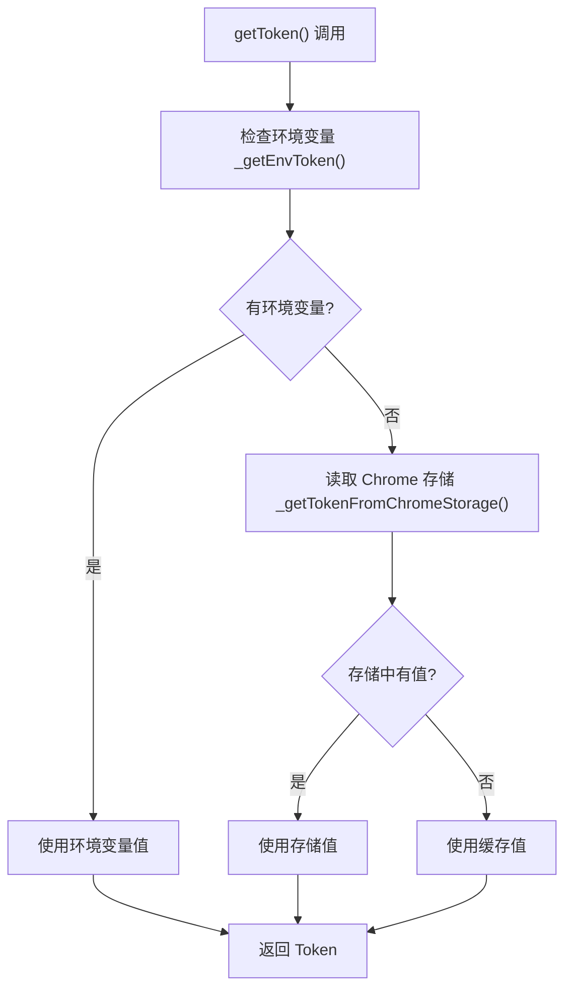
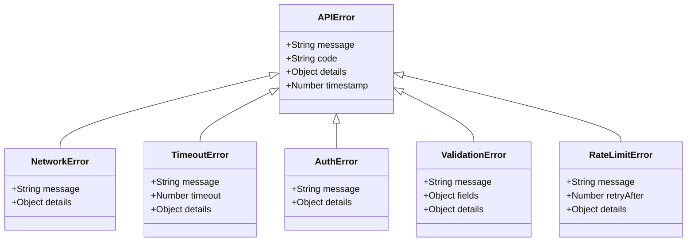
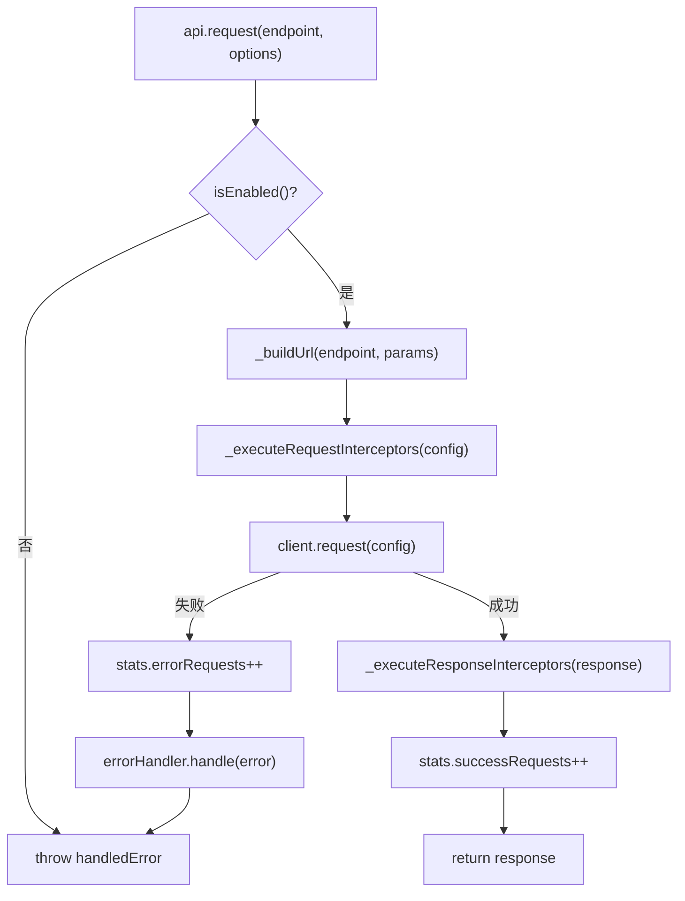
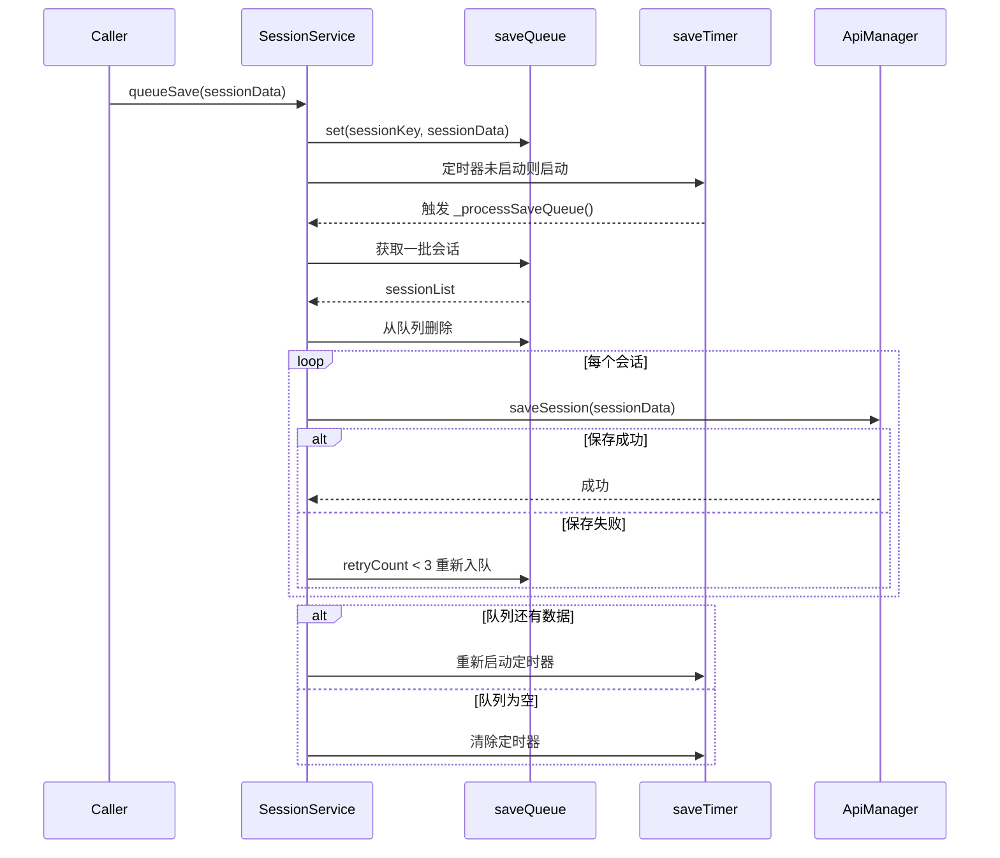
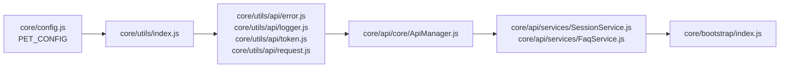

# 网络请求库 - 设计文档

> **文档版本**: v1.0 | **最后更新**: 2026-04-29 | **维护者**: doubao-seed-2-0-code-preview-260215 | **工具**: Claude Code
>
> **关联文档**: [需求文档](./01_需求文档.md) | [需求任务](./02_需求任务.md) | [使用文档](./04_使用文档.md) | [CLAUDE.md](../../CLAUDE.md)
>
> **来源**: 从现有代码库 `core/utils/api/` 和 `core/api/` 提取

## 架构概述

YiPet 网络请求库采用分层架构设计，从底层到上层依次为：工具层（RequestClient、TokenManager、ErrorHandler、Logger）→ 基类层（ApiManager）→ 服务层（SessionService、FaqService）。整体遵循单一职责原则，各模块通过 IIFE 模式挂载到全局命名空间，确保零构建直接运行。

### 架构分层图



### 核心设计原则

1. **零构建运行**: 所有代码使用原生 JavaScript，不依赖构建工具
2. **IIFE 封装**: 每个模块使用 IIFE 模式，避免全局污染
3. **职责单一**: 每个类只负责一个明确的功能领域
4. **可组合性**: ApiManager 整合多个工具组件，提供统一接口
5. **向后兼容**: 所有全局挂载保持稳定，不轻易修改

## 模块详细设计

### RequestClient - HTTP 请求客户端

**文件位置**: `core/utils/api/request.js`
**职责**: 封装 Fetch API，提供统一的 HTTP 请求接口
**设计模式**: 工厂模式（createRequestClient）+ 实例模式（requestClient 单例）

#### 核心属性

| 属性名 | 类型 | 说明 | 默认值 |
|--------|------|------|--------|
| defaultOptions | Object | 默认请求配置 | { timeout: 30000, mode: 'cors', credentials: 'omit', headers: { 'Content-Type': 'application/json' } } |
| abortControllers | Map | 请求中止控制器映射 | new Map() |
| activeRequests | Set | 活跃请求集合 | new Set() |

#### 核心方法

```javascript
class RequestClient {
  // 主请求方法
  async request(options = {}): Promise<any>

  // 便捷方法
  async get(url, params = {}, options = {}): Promise<any>
  async post(url, data = {}, options = {}): Promise<any>
  async put(url, data = {}, options = {}): Promise<any>
  async delete(url, options = {}): Promise<any>

  // 请求取消
  abort(abortKey): void

  // 内部辅助方法
  async _fetchWithRetry(url, options, retryCount = 0): Promise<any>
  async _parseResponse(response): Promise<any>
  _shouldRetry(error): boolean
  _buildFetchOptions(options): Object
  _buildUrlWithParams(url, params): string
  _delay(ms): Promise<void>
  destroy(): void
}
```

#### 关键设计点

1. **重试机制**: 网络错误和超时错误自动重试，最多 3 次，指数退避延迟（1s → 2s → 4s）
2. **超时控制**: 使用 AbortController + setTimeout 实现精确超时
3. **请求取消**: 通过 abortKey 支持取消指定请求
4. **数据格式处理**: 自动处理 JSON、FormData、Text、Blob 等数据格式
5. **响应解析**: 根据 Content-Type 自动解析响应数据
6. **业务错误码检查**: 对 JSON 响应检查 code 字段，非 0 抛出异常

#### 数据流图



---

### TokenManager - Token 管理器

**文件位置**: `core/utils/api/token.js`
**职责**: 管理 API 认证 Token，支持多种存储方式
**设计模式**: 工厂模式（createTokenManager）+ 实例模式（tokenManager 单例）

#### 核心属性

| 属性名 | 类型 | 说明 | 默认值 |
|--------|------|------|--------|
| storageKey | String | Chrome 存储键名 | 'YiPet.apiToken.v1' |
| _cachedToken | String | 内存缓存 Token | '' |
| _cacheInitialized | Boolean | 缓存是否已初始化 | false |

#### 核心方法

```javascript
class TokenManager {
  // Token 操作 - 异步
  async getToken(): Promise<string>
  async saveToken(token): Promise<boolean>
  async clearToken(): Promise<boolean>
  async hasToken(): Promise<boolean>
  async ensureTokenSet(): Promise<boolean>

  // Token 操作 - 同步
  getTokenSync(): string
  hasTokenSync(): boolean

  // 验证
  validateToken(token): boolean

  // 内部辅助方法
  _initCache(): void
  _getEnvToken(): string
  _isChromeStorageAvailable(): boolean
  async _getTokenFromChromeStorage(): Promise<string>
  async _saveTokenToChromeStorage(token): Promise<boolean>
}
```

#### 关键设计点

1. **多来源优先级**: 环境变量 > Chrome 存储 > 内存缓存
2. **环境变量支持**: window.__API_X_TOKEN__、process.env.API_X_TOKEN、self.__API_X_TOKEN__
3. **双重接口**: 同时提供同步（getTokenSync）和异步（getToken）接口
4. **懒初始化**: Chrome 存储读取延迟到首次访问
5. **格式验证**: validateToken 检查长度和字符格式

#### Token 获取流程图



---

### ErrorHandler - 错误处理器

**文件位置**: `core/utils/api/error.js`
**职责**: 统一错误分类、处理和重试机制
**设计模式**: 继承模式（多种错误类型继承 APIError）

#### 错误类型层级



#### 核心方法

```javascript
class ErrorHandler {
  async handle(error, context = {}): Promise<APIError>
  categorize(error): APIError

  // 错误类型判断
  isNetworkError(error): boolean
  isTimeoutError(error): boolean
  isAuthError(error): boolean
  isValidationError(error): boolean
  isRateLimitError(error): boolean

  // 内部辅助
  _shouldRetry(error, context): boolean
  async _retry(originalError, context): Promise<APIError>
  _getRetryDelay(error, retryCount): number
  _delay(ms): Promise<void>
}
```

#### 关键设计点

1. **错误分类**: 6 种具体错误类型，覆盖常见场景
2. **智能重试**: 网络错误、超时错误、限流错误自动重试
3. **指数退避**: 重试延迟随次数指数增长（1s → 2s → 4s）
4. **自定义回调**: 支持 onError 配置自定义错误处理
5. **结构化错误**: 错误包含 code、details、timestamp 等元信息

---

### Logger - 日志管理器

**文件位置**: `core/utils/api/logger.js`
**职责**: 统一的日志记录和级别控制
**设计模式**: 单例模式（logger 单例）+ 工具对象（LoggerUtils）

#### 日志级别

| 级别名 | 值 | 说明 |
|--------|---|------|
| DEBUG | 0 | 调试信息 |
| INFO | 1 | 一般信息（默认） |
| WARN | 2 | 警告信息 |
| ERROR | 3 | 错误信息 |
| NONE | 4 | 关闭日志 |

#### 核心方法

```javascript
class Logger {
  // 日志输出
  debug(...args): void
  info(...args): void
  warn(...args): void
  error(...args): void

  // 专用日志
  logRequest(config): void
  logResponse(response): void
  logError(error, context): void

  // 配置
  setLevel(level): void
  getLevel(): number
  enable(): void
  disable(): void
}
```

#### 关键设计点

1. **级别过滤**: 低于当前级别的日志不会输出
2. **前缀标识**: 每个日志实例可配置前缀（如 [SessionService]）
3. **结构化日志**: logRequest/logResponse/logError 记录格式化信息
4. **时间戳**: 可选包含时间戳（默认启用）

---

### ApiManager - API 管理器基类

**文件位置**: `core/api/core/ApiManager.js`
**职责**: 整合各工具组件，提供统一的服务基类
**设计模式**: 组合模式（整合多个工具类）+ 模板方法模式（子类继承扩展）

#### 核心属性

| 属性名 | 类型 | 说明 |
|--------|------|------|
| baseUrl | String | API 基础 URL |
| enabled | Boolean | 是否启用 |
| client | RequestClient | 请求客户端实例 |
| errorHandler | ErrorHandler | 错误处理器实例 |
| logger | Logger | 日志器实例 |
| tokenManager | TokenManager | Token 管理器实例 |
| requestInterceptors | Array | 请求拦截器链 |
| responseInterceptors | Array | 响应拦截器链 |
| stats | Object | 统计信息（总请求、成功、失败、重试） |

#### 核心方法

```javascript
class ApiManager {
  // 主请求方法
  async request(endpoint, options = {}): Promise<any>

  // 便捷方法
  async get(endpoint, params = {}, options = {}): Promise<any>
  async post(endpoint, data = {}, options = {}): Promise<any>
  async put(endpoint, data = {}, options = {}): Promise<any>
  async delete(endpoint, options = {}): Promise<any>

  // 拦截器
  addRequestInterceptor(interceptor): void
  addResponseInterceptor(interceptor): void

  // 统计
  getStats(): Object
  resetStats(): void

  // 生命周期
  isEnabled(): boolean
  destroy(): void

  // 内部辅助
  async _executeRequestInterceptors(config): Promise<Object>
  async _executeResponseInterceptors(response): Promise<any>
  _buildUrl(endpoint, params = {}): string
  _setupDefaultInterceptors(): void
}
```

#### 关键设计点

1. **默认拦截器**:
   - Token 拦截器: 自动在请求头添加 X-Token
   - 日志拦截器: 自动记录请求和响应

2. **拦截器链模式**:
   - 请求拦截器按添加顺序执行
   - 响应拦截器按添加顺序执行
   - 每个拦截器接收并返回配置/响应

3. **统计收集**:
   - totalRequests: 总请求数
   - successRequests: 成功请求数
   - errorRequests: 失败请求数
   - retryRequests: 重试请求数
   - successRate: 成功率（动态计算）

#### 请求处理流程图



---

### SessionService - 会话服务

**文件位置**: `core/api/services/SessionService.js`
**职责**: 封装会话相关 API 操作
**设计模式**: 继承模式（继承 ApiManager）+ 队列模式（批量保存）

#### 核心属性

| 属性名 | 类型 | 说明 |
|--------|------|------|
| saveQueue | Map | 待保存会话队列 |
| saveTimer | Timeout/null | 批量保存定时器 |
| saveBatchSize | Number | 每批保存数量 |
| saveInterval | Number | 保存间隔（ms） |
| stats | Object | 扩展统计信息（saveCount、queueSize） |

#### 核心方法

```javascript
class SessionService extends ApiManager {
  // CRUD
  async getSessionsList(options = {}): Promise<Array>
  async getSession(sessionKey): Promise<Object|null>
  async createSession(sessionData): Promise<Object>
  async saveSession(sessionData): Promise<Object>
  async deleteSession(sessionKey): Promise<Object>
  async deleteSessions(sessionKeys): Promise<Object>

  // 搜索
  async searchSessions(query, options = {}): Promise<Array>

  // 批量队列
  queueSave(sessionData): void
  async _processSaveQueue(): Promise<void>
  async flushSaveQueue(): Promise<void>

  // 统计
  getStats(): Object

  // 内部辅助
  _normalizeSessionData(sessionData): Object
  _normalizeTimestamp(timestamp): Number
}
```

#### 关键设计点

1. **批量保存队列**:
   - queueSave: 添加到队列，不立即发送
   - _processSaveQueue: 定时处理队列，批量保存
   - flushSaveQueue: 立即处理所有待保存项

2. **数据库 URL 构建**:
   - 使用 PET_CONFIG.buildDatabaseUrl()
   - 统一调用后端数据服务接口

3. **数据规范化**:
   - _normalizeSessionData: 统一会话数据格式
   - _normalizeTimestamp: 统一时间戳格式

#### 批量保存流程图



---

### FaqService - FAQ 服务

**文件位置**: `core/api/services/FaqService.js`
**职责**: 封装常见问题相关 API 操作
**设计模式**: 继承模式（继承 ApiManager）

#### 核心属性

| 属性名 | 类型 | 说明 |
|--------|------|------|
| cname | String | 集合名称（'faqs'） |

#### 核心方法

```javascript
class FaqService extends ApiManager {
  // CRUD
  async getFaqs(options = {}): Promise<Array>
  async createFaq(faqData): Promise<Object>
  async updateFaq(key, patch): Promise<Object>
  async deleteFaq(key): Promise<Object>

  // 批量操作
  async saveFaqs(faqs): Promise<Object>
  async batchUpdateOrder(orders): Promise<Array>

  // 筛选与搜索
  async getFaqsByTags(tags, options = {}): Promise<Array>
  async searchFaqs(query, options = {}): Promise<Array>
  async getAllTags(): Promise<Array>

  // 缓存（预留）
  clearGetCache(): void

  // 内部辅助
  _normalizeFaqData(faqData): Object
}
```

#### 关键设计点

1. **灵活数据格式**:
   - 支持 title+prompt 格式
   - 支持 text 单一格式（自动分割）
   - 自动归一化处理

2. **批量更新排序**:
   - 使用 Promise.all 并行更新
   - 高效处理排序变更

3. **标签功能**:
   - getFaqsByTags: 按标签筛选
   - getAllTags: 获取所有标签集合

---

## 配置管理设计

### PET_CONFIG 全局配置

**文件位置**: `core/config.js`

#### 配置结构

```javascript
const DEFAULT_CONFIG = {
  // API 配置
  api: {
    streamPromptUrl: 'https://api.effiy.cn/prompt',
    promptUrl: 'https://api.effiy.cn/prompt/',
    yiaiBaseUrl: 'https://api.effiy.cn',
    faqApiUrl: 'https://api.effiy.cn',
    syncSessionsToBackend: true
  },

  // 端点配置（向后兼容）
  ENDPOINTS: {
    BASE_ENDPOINTS: { API_BASE, V1_BASE, V2_BASE },
    AUTH_ENDPOINTS: { LOGIN, LOGOUT, REFRESH, PROFILE, VALIDATE },
    SESSION_ENDPOINTS: { LIST, CREATE, UPDATE, DELETE, BATCH_DELETE, SEARCH, FAVORITES, EXPORT, IMPORT },
    FAQ_ENDPOINTS: { LIST, CREATE, UPDATE, DELETE, BATCH_UPDATE, REORDER },
    CONFIG_ENDPOINTS: { GET, UPDATE, RESET },
    DATABASE_ENDPOINTS: { QUERY, CREATE, UPDATE, DELETE, BATCH }
  },

  // 环境配置
  env: {
    mode: 'production',
    flags: { debug, mockApi, telemetry },
    endpoints: {
      production: { ... },
      staging: { ... },
      development: { ... }
    }
  },

  // 常量配置
  constants: {
    TIMING: { RETRY_DELAY, STATUS_SYNC_INTERVAL, ... },
    RETRY: { MAX_RETRIES, INITIAL_DELAY },
    STORAGE: { MAX_REQUESTS, MAX_SESSION_SIZE, SYNC_INTERVAL },
    URLS: { CHROME_PROTOCOL, CHROME_EXTENSION_PROTOCOL, ... },
    ERROR_MESSAGES: { ... },
    SUCCESS_MESSAGES: { ... }
  },

  // 工具函数
  buildUrl(baseUrl, endpoint, params): string
  buildQueryParams(params): string
  buildDatabaseUrl(baseUrl, methodName, parameters): string
}
```

#### 环境变量注入

- `window.__PET_ENV_MODE__`: 环境模式（production/staging/development）
- `window.__API_X_TOKEN__`: API Token（优先级最高）
- `process.env.API_X_TOKEN`: Node.js 环境 Token
- `process.env.PET_ENV_MODE`: Node.js 环境模式

---

## Manifest 加载顺序设计

### 依赖关系图



### Manifest.json 配置要点

```javascript
{
  "content_scripts": [
    {
      "matches": ["<all_urls>"],
      "js": [
        // 1. 配置最先加载
        "core/config.js",

        // 2. 第三方库（如有）
        "libs/md5.js",

        // 3. 工具层（按依赖顺序）
        "core/utils/index.js",
        "core/utils/api/error.js",
        "core/utils/api/logger.js",
        "core/utils/api/token.js",
        "core/utils/api/request.js",

        // 4. API 基类
        "core/api/core/ApiManager.js",

        // 5. API 服务
        "core/api/services/SessionService.js",
        "core/api/services/FaqService.js",

        // 6. 业务模块
        "modules/pet/...",

        // 7. 启动入口
        "core/bootstrap/index.js"
      ]
    }
  ]
}
```

---

## 数据格式设计

### 会话数据格式（Session）

```javascript
{
  key: String,              // 会话唯一标识
  url: String,              // 来源页面 URL
  title: String,            // 会话标题
  pageDescription: String,  // 页面描述
  messages: Array,          // 消息列表
  tags: Array<String>,      // 标签列表
  isFavorite: Boolean,      // 是否收藏
  createdAt: Number,        // 创建时间戳
  updatedAt: Number,        // 更新时间戳
  lastAccessTime: Number    // 最后访问时间戳
}
```

### FAQ 数据格式

```javascript
{
  key: String,              // FAQ 唯一标识
  id: String,               // （兼容）ID
  _id: String,              // （兼容）Mongo ID
  title: String,            // 标题
  prompt: String,           // 提示词内容
  text: String,             // 完整文本（title + prompt）
  tags: Array<String>,      // 标签列表
  order: Number,            // 排序序号
  updatedTime: Number       // 更新时间戳
}
```

---

## 安全设计

### Token 安全

1. **存储安全**:
   - 使用 chrome.storage.local（扩展隔离存储）
   - 不使用 localStorage（共享存储域）

2. **传输安全**:
   - Token 通过 HTTPS 传输（配置的 API 端点都是 https）
   - Token 在请求头中传递（X-Token）

3. **验证安全**:
   - validateToken 检查基本格式
   - 不记录完整 Token 到日志（只记录存在状态）

### 错误信息安全

1. **不泄露敏感信息**:
   - 错误信息不包含 Token、密码等
   - 网络错误只记录错误类型，不记录响应内容

2. **生产环境日志控制**:
   - DEBUG 日志在生产环境默认关闭
   - 可通过 PET_CONFIG.env.flags.debug 配置

---

## 性能优化设计

### 1. 批量处理

- SessionService 队列批量保存，减少请求次数
- FaqService 并行更新排序，提高效率

### 2. 缓存策略

- TokenManager 内存缓存，减少存储读取
- Logger 级别过滤，减少不必要的 I/O

### 3. 重试策略

- 指数退避避免请求风暴
- 最大重试次数限制（3 次）

### 4. 请求优化

- 复用 AbortController 正确清理
- 超时及时释放连接资源

---

## 扩展性设计

### 1. 拦截器扩展

```javascript
// 自定义请求拦截器
apiManager.addRequestInterceptor(async (config) => {
  // 修改请求配置
  config.headers['X-Custom-Header'] = 'value';
  return config;
});

// 自定义响应拦截器
apiManager.addResponseInterceptor(async (response) => {
  // 修改响应数据
  return transformResponse(response);
});
```

### 2. 服务类扩展

```javascript
class MyService extends ApiManager {
  constructor(baseUrl, options = {}) {
    super(baseUrl, {
      logger: { prefix: '[MyService]' },
      ...options
    });
  }

  async myMethod(params) {
    return this.post('/my-endpoint', params);
  }
}
```

### 3. 自定义错误处理

```javascript
const errorHandler = new ErrorHandler({
  maxRetries: 5,
  retryDelay: 2000,
  onError: async (error, context) => {
    // 自定义错误处理逻辑
    await reportToMonitoring(error, context);
  }
});
```

---

## 文件清单

### 核心文件

| 文件路径 | 说明 | 行数（约） |
|----------|------|----------|
| `core/config.js` | 全局配置 | 295 |
| `core/utils/api/request.js` | HTTP 请求客户端 | 307 |
| `core/utils/api/token.js` | Token 管理器 | 332 |
| `core/utils/api/error.js` | 错误处理器 | 388 |
| `core/utils/api/logger.js` | 日志管理器 | 180 |
| `core/api/core/ApiManager.js` | API 管理器基类 | 255 |
| `core/api/services/SessionService.js` | 会话服务 | 400 |
| `core/api/services/FaqService.js` | FAQ 服务 | 332 |

### 相关文件

| 文件路径 | 说明 |
|----------|------|
| `manifest.json` | 扩展配置（脚本加载顺序） |
| `core/utils/index.js` | 工具模块入口 |
| `modules/extension/background/services/injectionService.js` | 后台脚本注入服务 |
