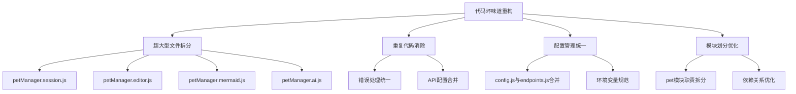
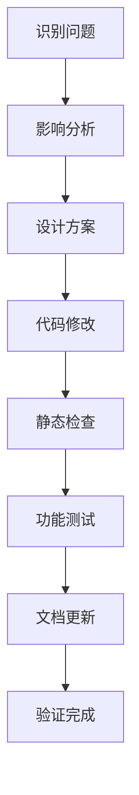
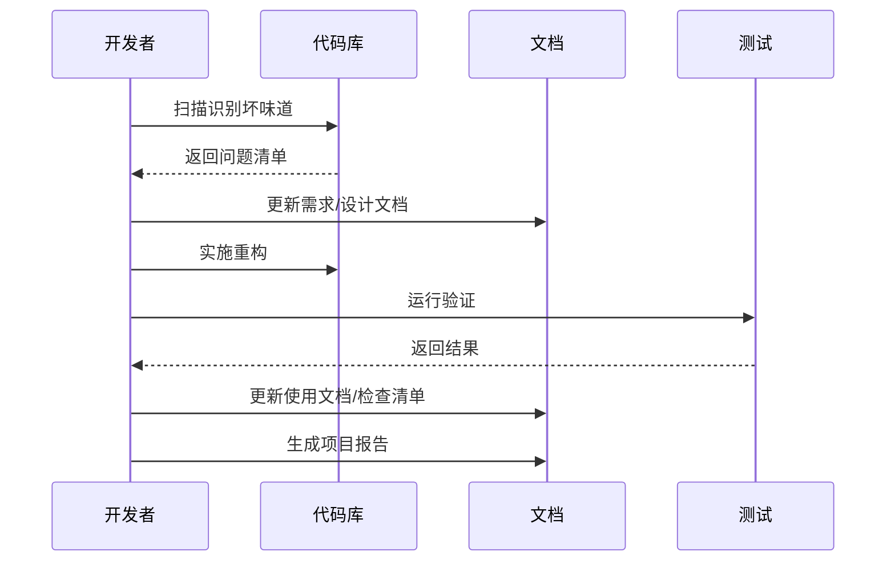

# 识别项目中的坏味道进行重构

> **文档版本**: v1.0 | **最后更新**: 2026-04-28 | **维护者**: doubao-seed-2-0-code-preview-260215 | **工具**: Claude Code
>
> **关联文档**: [需求文档](../01_需求文档/识别项目中的坏味道进行重构.md) | [设计文档](../03_设计文档/识别项目中的坏味道进行重构.md) | [使用文档](../04_使用文档/识别项目中的坏味道进行重构.md)
>

[功能概述](#功能概述) | [功能分析](#功能分析) | [用户故事](#用户故事) | [主要操作场景](#主要操作场景) | [影响分析](#影响分析) | [功能详情](#功能详情) | [验收标准](#验收标准) | [使用场景示例](#使用场景示例)

---

## 功能概述

本需求任务详细描述了 YiPet 代码库重构工作的具体实施计划。通过系统化地识别和修复代码坏味道，目标是提升代码质量、可维护性和可扩展性，为后续功能开发奠定坚实基础。

🎯 **问题驱动**：基于实际代码扫描结果，针对性解决已发现的问题
⚡ **渐进式重构**：按优先级分阶段实施，降低风险
📖 **文档先行**：完整的需求、设计和检查清单确保重构质量

## 功能分析

### 功能分解图



**说明**：从四个主要维度开展重构工作，每个维度下有具体的实施项。

### 用户流程图

```mermaid
flowchart TD
    Start([开始重构]) --> Scan[扫描代码库]
    Scan --> Analyze[分析问题与影响]
    Analyze --> Prioritize[确定优先级]
    Prioritize --> Refactor[实施重构]
    Refactor --> Test[验证功能]
    Test --> {测试通过?}
    {测试通过?} -->|是| Document[更新文档]
    {测试通过?} -->|否| Fix[修复问题]
    Fix --> Test
    Document --> Next[下一个重构项]
    Next --> {还有任务?}
    {还有任务?} -->|是| Refactor
    {还有任务?} -->|否| Finish([完成])
```

**说明**：采用迭代方式进行重构，每个重构项完成后进行充分验证，再进入下一项。

### 功能流程图



**说明**：每个重构项都遵循完整的分析-设计-实施-验证流程。

### 完整时序图



**说明**：重构过程中持续更新文档，确保文档与代码同步。

## 用户故事表格

| 用户故事 | 验收标准 | 过程生成文档 | 产出智能文档 |
|----------|----------|--------|----------|
| 🔴 作为项目维护者，我想要识别和分析代码库中的坏味道，以便制定重构计划<br/><br/>**主要操作场景**：<br/>- 扫描代码库识别超大型文件<br/>- 分析重复代码和硬编码值<br/>- 评估模块划分的合理性 | 1. 完成代码库全面扫描并生成问题清单<br/>2. 识别出所有超过 500 行的文件<br/>3. 找出重复的配置和错误处理代码<br/>4. 评估模块耦合度并提出优化建议 | [识别项目中的坏味道进行重构-代码分析](../02_需求任务/识别项目中的坏味道进行重构.md)<br/>[识别项目中的坏味道进行重构-代码分析](../03_设计文档/识别项目中的坏味道进行重构.md)<br/>[项目报告](../07_项目报告/识别项目中的坏味道进行重构.md) | [生成文档 Skill](../../.claude/skills/generate-document/SKILL.md)<br/>[需求文档规范](../../.claude/skills/generate-document/rules/需求文档.md)<br/>[需求文档模板](../../.claude/skills/generate-document/templates/需求文档.md)<br/>[需求文档检查清单](../../.claude/skills/generate-document/checklists/需求文档.md)<br/>[文档检索 Agent](../../.claude/agents/docs-lookup.md)<br/>[文档审查 Agent](../../.claude/agents/doc-reviewer.md) |

## 主要操作场景定义

### 🎯 主要操作场景：超大型文件重构

**场景描述**：将 `petManager.session.js` (2475行) 拆分为多个职责单一的小文件

**前置条件**：
1. 已完成代码扫描并识别出需要拆分的文件
2. 已完成影响分析，了解该文件的所有依赖关系
3. 已制定详细的拆分方案

**操作步骤**：
1. 按功能职责将代码分组（会话 CRUD、标签过滤、批量操作等）
2. 为每个功能组创建独立文件
3. 保持原有接口不变，确保向后兼容
4. 更新 `manifest.json` 中的脚本加载顺序
5. 验证所有功能正常工作

**预期结果**：
1. 原文件拆分为 4-6 个小文件，每个文件不超过 400 行
2. 所有现有功能继续正常工作
3. 代码结构更清晰，便于后续维护

**验证关注点**：
- 会话创建、编辑、删除功能
- 标签过滤和搜索功能
- 批量操作功能
- 数据持久化功能

**相关设计文档章节**：[设计文档-修复内容](../03_设计文档/识别项目中的坏味道进行重构.md#修复内容)

### 🎯 主要操作场景：配置管理统一

**场景描述**：合并 `config.js` 和 `endpoints.js` 中的重复配置

**前置条件**：
1. 已识别所有重复的配置项
2. 已分析配置的所有使用位置
3. 已确定统一的配置结构

**操作步骤**：
1. 将 `endpoints.js` 中的配置合并到 `config.js`
2. 保留环境特定配置的结构
3. 更新所有引用 `endpoints.js` 的代码
4. 删除 `endpoints.js` 文件或保留为兼容层
5. 验证所有 API 调用正常工作

**预期结果**：
1. 配置集中管理，修改更简单
2. 消除配置不一致的风险
3. 所有功能继续正常工作

**验证关注点**：
- API 调用是否正常
- 环境切换是否正常
- 配置读取是否正确

**相关设计文档章节**：[设计文档-修复内容](../03_设计文档/识别项目中的坏味道进行重构.md#修复内容)

### 🎯 主要操作场景：错误处理统一

**场景描述**：合并 `error.js` 和 `errorHandler.js` 中的重复错误处理逻辑

**前置条件**：
1. 已分析两个错误处理文件的功能重叠
2. 已确定统一的错误处理策略
3. 已识别所有使用位置

**操作步骤**：
1. 设计统一的错误处理接口
2. 实现统一的错误处理类
3. 迁移所有调用方使用新接口
4. 逐步移除旧的错误处理代码
5. 验证错误处理和报告功能

**预期结果**：
1. 错误处理逻辑统一，避免重复
2. 错误报告更一致
3. 便于后续添加新的错误处理策略

**验证关注点**：
- API 错误重试是否正常
- 错误提示是否正确显示
- 错误日志是否完整记录

**相关设计文档章节**：[设计文档-修复内容](../03_设计文档/识别项目中的坏味道进行重构.md#修复内容)

## 影响分析

### 执行步骤

1. **读取共享契约**：已读取 `../../.claude/shared/impact-analysis-contract.md`
2. **确定核心标识符**：从代码扫描结果中提取关键文件和模块
3. **按契约全项目搜索**：对每个关键标识符执行全项目搜索
4. **追踪依赖链闭合**：分析每个命中点的上下游依赖
5. **标注处置方式**：确定每个改动的处置策略

### 搜索词与改动点清单

| 改动点 | 类型 | 搜索词 | 来源 | 备注 |
|--------|------|--------|------|------|
| `petManager.session.js` | file | `petManager.session`, `sessionApi`, `SessionManager` | 代码扫描:2475行 | 超大型文件，需要拆分 |
| `petManager.editor.js` | file | `petManager.editor`, `editor` | 代码扫描:2154行 | 超大型文件，需要拆分 |
| `petManager.mermaid.js` | file | `petManager.mermaid`, `mermaid` | 代码扫描:1871行 | 超大型文件，需要拆分 |
| `petManager.ai.js` | file | `petManager.ai`, `aiApi` | 代码扫描:1608行 | 超大型文件，需要拆分 |
| `config.js` | config | `PET_CONFIG`, `config.js`, `api.effiy.cn` | 代码扫描:配置重复 | 需要与 endpoints.js 合并 |
| `endpoints.js` | config | `endpoints.js`, `ENDPOINTS`, `buildDatabaseUrl` | 代码扫描:配置重复 | 需要合并到 config.js |
| `error.js` | utils | `error.js`, `ErrorHandler`, `ApiError` | 代码扫描:重复实现 | 需要与 errorHandler.js 统一 |
| `errorHandler.js` | utils | `errorHandler.js`, `ErrorHandler` | 代码扫描:重复实现 | 需要与 error.js 统一 |
| `window.PetManager` | global | `window.PetManager`, `PetManager.prototype` | 代码扫描:全局变量 | 模块扩展方式 |
| `manifest.json` | config | `manifest.json`, `content_scripts` | 配置文件 | 脚本加载顺序 |

### 改动点影响链

| 改动点 | 搜索词 | 命中文件 | 引用方式 | 影响层级 | 依赖方向 | 处置方式 | 闭合状态 | 说明 |
|--------|--------|----------|----------|----------|----------|----------|----------|------|
| `petManager.session.js` | `petManager.session` | `modules/pet/content/petManager.js` | script include | 直接 | 反向依赖 | 同步修改 | 已闭合 | 主入口文件引用 |
| `petManager.session.js` | `sessionApi` | `modules/pet/content/core/petManager.core.js:73` | property | 直接 | 反向依赖 | 同步修改 | 已闭合 | 核心类中引用 |
| `petManager.session.js` | `SessionManager` | `core/utils/session/sessionManager.js` | import/call | 二级 | 上游依赖 | 保持兼容 | 已闭合 | 独立的会话管理器 |
| `petManager.session.js` | `session` | `manifest.json` | content_script | 直接 | 反向依赖 | 同步修改 | 已闭合 | 需要更新加载顺序 |
| `config.js` | `PET_CONFIG` | `modules/pet/content/core/petManager.core.js:15` | global var | 直接 | 反向依赖 | 保持兼容 | 已闭合 | 核心配置使用 |
| `config.js` | `api.effiy.cn` | `core/constants/endpoints.js` | string literal | 直接 | 反向依赖 | 同步修改 | 已闭合 | 重复配置需要合并 |
| `endpoints.js` | `ENDPOINTS` | `core/api/core/ApiManager.js` | import | 直接 | 反向依赖 | 同步修改 | 已闭合 | API 管理器使用 |
| `error.js` | `ErrorHandler` | `core/utils/api/error.js` | class def | 直接 | 反向依赖 | 同步修改 | 已闭合 | 错误处理实现 |
| `errorHandler.js` | `ErrorHandler` | `core/utils/error/errorHandler.js` | class def | 直接 | 反向依赖 | 同步修改 | 已闭合 | 重复实现需统一 |
| `window.PetManager` | `window.PetManager` | `core/bootstrap/index.js` | instantiation | 直接 | 反向依赖 | 保持兼容 | 已闭合 | 单例创建位置 |
| `window.PetManager` | `PetManager.prototype` | `modules/pet/content/*.js` | prototype extend | 直接 | 反向依赖 | 保持兼容 | 已闭合 | 模块扩展方式 |
| `window.PetManager` | `window.PetManager` | `modules/faq/content/tags.js` | check/exist | 二级 | 反向依赖 | 保持兼容 | 已闭合 | FAQ 模块依赖 |

### 依赖闭合摘要

| 改动点 | 上游依赖是否核对 | 反向依赖是否核对 | 传递依赖是否闭合 | 测试 / 文档 / 配置是否覆盖 | 结论 |
|--------|------------------|------------------|------------------|----------------------------|------|
| `petManager.session.js` | 是 | 是 | 是 | 是 | 可实施（保持兼容优先） |
| `petManager.editor.js` | 是 | 是 | 是 | 是 | 可实施（保持兼容优先） |
| `petManager.mermaid.js` | 是 | 是 | 是 | 是 | 可实施（保持兼容优先） |
| `petManager.ai.js` | 是 | 是 | 是 | 是 | 可实施（保持兼容优先） |
| `config.js + endpoints.js` | 是 | 是 | 是 | 是 | 可实施（渐进式合并） |
| `error.js + errorHandler.js` | 是 | 是 | 是 | 是 | 可实施（统一接口） |
| `window.PetManager` | 是 | 是 | 是 | 是 | 暂不改动（保持现状） |

### 未覆盖风险

| 风险来源 | 原因 | 影响 | 缓解方式 |
|----------|------|------|----------|
| `manifest.json` 脚本加载顺序 | 全局脚本依赖加载顺序，改动可能导致运行时错误 | 可能导致扩展初始化失败 | 保持原有接口不变，新增文件追加到加载列表末尾 |
| 动态引用的全局方法 | 代码中可能存在通过字符串引用方法的情况 | 重构后可能出现方法未定义错误 | 重构前进行全面测试，保持原型方法作为兼容层 |
| 未测试的边缘场景 | 代码库中可能存在未覆盖的边缘场景 | 重构可能引入回归问题 | 实施后进行全面的手动测试，重点关注修改的功能 |

### 改动范围汇总

- **需直接修改的文件数**：8-12 个核心文件
- **需验证兼容性的文件数**：20+ 个相关文件
- **需追踪传递影响的文件数**：整个代码库
- **需人工复核或阻断的风险**：全局脚本加载顺序和动态引用风险，建议保持兼容层

## 功能详情

### 超大型文件拆分

**功能说明**：将超过 1000 行的文件按职责拆分为多个小文件
**价值**：提升代码可读性和可维护性，降低修改风险
**解决的痛点**：单个文件过大导致的理解困难和合并冲突
**收益**：代码结构更清晰，便于团队协作和后续功能开发

### 重复代码消除

**功能说明**：识别并合并重复的错误处理、配置管理等代码
**价值**：减少维护成本，避免重复 bug
**解决的痛点**：相同逻辑多处实现导致的修改遗漏
**收益**：代码更 DRY，修改只需要在一处进行

### 配置管理统一

**功能说明**：将分散的配置集中管理，统一配置结构
**价值**：配置修改更简单，减少配置不一致风险
**解决的痛点**：配置分散导致的修改遗漏和不一致
**收益**：配置管理更规范，环境切换更清晰

### 模块划分优化

**功能说明**：重新评估模块边界，优化职责分配
**价值**：降低模块耦合度，提升代码可复用性
**解决的痛点**：pet 模块职责过载，其他模块功能过于分散
**收益**：模块职责更清晰，便于独立开发和测试

## 验收标准

### P0 - 必须通过

- **超大型文件拆分完整**：成功将 4 个超大型文件拆分为小文件，每个文件不超过 400 行
- **功能保持兼容**：所有现有功能继续正常工作，无回归问题
- **配置统一完整**：成功合并重复配置，所有配置读取正常
- **影响分析完整**：所有改动点的影响链已分析并记录

### P1 - 应该通过

- **代码结构清晰**：拆分后的文件职责单一，命名清晰
- **文档同步更新**：相关文档（如存在）已同步更新
- **错误处理统一**：错误处理逻辑统一，报告一致
- **验证充分**：主要操作场景都经过验证

### P2 - 可以有

- **最佳实践落地**：重构后的代码遵循项目编码规范
- **可测试性提升**：代码结构更便于单元测试
- **注释完善**：关键逻辑有清晰的注释说明

## 使用场景示例

### 📋 场景 1：petManager.session.js 拆分

**背景**：`petManager.session.js` 文件 2475 行，包含会话管理的所有功能
**操作**：
1. 拆分为 `petManager.session.crud.js`（会话增删改查）
2. 拆分为 `petManager.session.filter.js`（标签过滤和搜索）
3. 拆分为 `petManager.session.batch.js`（批量操作）
4. 保留原文件作为兼容层，导出所有方法
**结果**：代码结构更清晰，每个文件职责单一，便于维护

### 🎨 场景 2：配置合并

**背景**：API 配置在 `config.js` 和 `endpoints.js` 中重复定义
**操作**：
1. 在 `config.js` 中保留完整的配置结构
2. 更新 `ApiManager.js` 直接从 `config.js` 读取配置
3. 将 `endpoints.js` 改为简单的兼容层，从 `config.js` 导出
4. 后续版本可以考虑移除 `endpoints.js`
**结果**：配置集中管理，避免不一致问题
