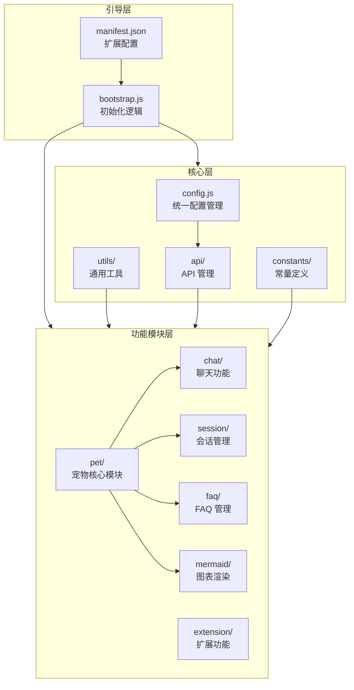
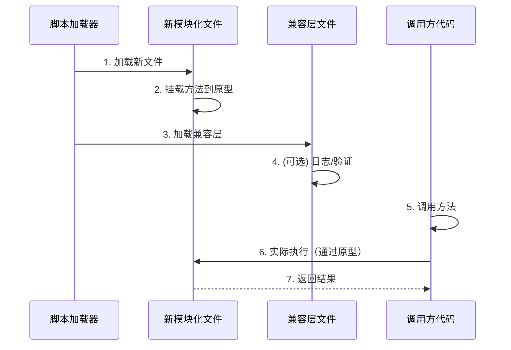

# 识别项目中的坏味道进行重构设计

> **文档版本**: v1.0 | **最后更新**: 2026-04-28 | **维护者**: doubao-seed-2-0-code-preview-260215 | **工具**: Claude Code
>
> **关联文档**: [需求任务](../02_需求任务/识别项目中的坏味道进行重构.md) | [使用文档](../04_使用文档/识别项目中的坏味道进行重构.md) | [CLAUDE.md](../../CLAUDE.md)
>

[设计概述](#设计概述) | [架构设计](#架构设计) | [修复内容](#修复内容) | [影响分析](#影响分析) | [实现细节](#实现细节) | [主要操作场景实现](#主要操作场景实现) | [数据结构](#数据结构)

---

## 设计概述

本设计文档详细描述了 YiPet 代码库重构的技术方案。采用渐进式重构策略，保持向后兼容性的同时，逐步改善代码质量。重点解决超大型文件、重复代码、配置分散等问题，为后续功能开发奠定坚实基础。

🎯 **兼容性优先**：所有重构保持现有接口不变，通过兼容层确保平滑过渡
⚡ **渐进式实施**：分阶段进行重构，每个阶段独立验证，降低风险
🔧 **最小改动原则**：只修改必要的代码，避免过度工程化

## 架构设计

### 整体架构



**说明**：保持现有三层架构不变，重点优化各层内部的模块划分和职责分配。

### 模块划分

| 模块名称 | 职责 | 文件位置 |
|----------|------|----------|
| SessionCRUD | 会话增删改查操作 | `modules/pet/content/session/petManager.session.crud.js` |
| SessionFilter | 会话过滤和搜索 | `modules/pet/content/session/petManager.session.filter.js` |
| SessionBatch | 会话批量操作 | `modules/pet/content/session/petManager.session.batch.js` |
| SessionTag | 会话标签管理 | `modules/pet/content/session/petManager.session.tag.js` |
| EditorCore | 编辑器核心功能 | `modules/pet/content/editor/petManager.editor.core.js` |
| EditorUI | 编辑器 UI 组件 | `modules/pet/content/editor/petManager.editor.ui.js` |
| MermaidRenderer | Mermaid 渲染核心 | `modules/pet/content/mermaid/petManager.mermaid.renderer.js` |
| MermaidUI | Mermaid UI 交互 | `modules/pet/content/mermaid/petManager.mermaid.ui.js` |
| AiApi | AI API 封装 | `modules/pet/content/ai/petManager.ai.api.js` |
| AiPrompt | AI 提示词管理 | `modules/pet/content/ai/petManager.ai.prompt.js` |
| UnifiedConfig | 统一配置管理 | `core/config.js` (增强) |
| UnifiedError | 统一错误处理 | `core/utils/error/unifiedErrorHandler.js` |

### 核心流程图

```mermaid
flowchart TD
    Start([重构开始]) --> CheckCompat{检查兼容性}
    CheckCompat -->|兼容方案| CreateLayer[创建兼容层]
    CheckCompat -->|直接重构| Refactor[实施重构]
    CreateLayer --> MoveCode[迁移代码到新文件]
    MoveCode --> UpdateRef[更新引用]
    Refactor --> UpdateRef
    UpdateRef --> Test[功能测试]
    Test -->{通过?}
    {通过?} -->|是| Cleanup[清理兼容层<br/>可选]
    {通过?} -->|否| Rollback[回滚修改]
    Cleanup --> Finish([完成])
    Rollback --> Fix[修复问题]
    Fix --> Test
```

**说明**：优先使用兼容层方案，确保重构可以随时回滚，降低风险。

## 修复内容

### 问题分析

#### 1. 超大型文件问题

**问题描述**：
- `petManager.session.js`: 2475 行，包含会话管理所有功能
- `petManager.editor.js`: 2154 行，包含编辑器所有功能
- `petManager.mermaid.js`: 1871 行，包含 Mermaid 渲染所有功能
- `petManager.ai.js`: 1608 行，包含 AI 对话所有功能

**产生原因**：
- 采用原型扩展方式，所有功能往一个文件堆
- 缺乏明确的模块边界划分
- 功能持续累积但未及时重构

**影响范围**：
- 代码可读性差，新成员理解困难
- 修改风险高，容易引入回归问题
- Git 合并冲突频繁
- 难以进行单元测试

#### 2. 配置分散问题

**问题描述**：
- `config.js`: 包含 API 地址等配置
- `endpoints.js`: 包含 API 端点定义和 URL 构建函数
- 两个文件存在重复配置（如 `api.effiy.cn`）

**产生原因**：
- 配置管理缺乏统一规划
- 不同时期添加的配置放不同位置
- 缺少配置合并的重构

**影响范围**：
- 修改配置需要改多处
- 容易出现配置不一致
- 环境切换不清晰

#### 3. 错误处理重复问题

**问题描述**：
- `core/utils/api/error.js`: API 错误处理
- `core/utils/error/errorHandler.js`: 通用错误处理
- 两个文件都定义了 `ErrorHandler` 类

**产生原因**：
- 错误处理策略演进过程中产生重复
- 缺乏统一的错误处理规范

**影响范围**：
- 错误报告方式不统一
- 维护成本高
- 新增错误处理逻辑不知道该放哪里

### 修复方案

#### 方案 1：超大型文件拆分（兼容层策略）

**整体思路**：
1. 创建新的模块化文件结构
2. 将代码按职责迁移到新文件
3. 原文件保留为兼容层，从新文件重新导出
4. 逐步更新调用方使用新文件
5. 后续版本可以考虑移除兼容层

**需要修改的文件清单**：
1. `modules/pet/content/modules/petManager.session.js` → 拆分为 4 个文件
2. `modules/pet/content/modules/petManager.editor.js` → 拆分为 2 个文件
3. `modules/pet/content/modules/petManager.mermaid.js` → 拆分为 2 个文件
4. `modules/pet/content/modules/petManager.ai.js` → 拆分为 2 个文件
5. `manifest.json` → 更新 `content_scripts` 加载顺序

**具体修改内容**：

**petManager.session.js 拆分**：
```javascript
// 新文件 1: petManager.session.crud.js
// 职责：会话的创建、读取、更新、删除

// 新文件 2: petManager.session.filter.js
// 职责：标签过滤、搜索、日期范围过滤

// 新文件 3: petManager.session.batch.js
// 职责：批量选择、批量删除、批量导出

// 新文件 4: petManager.session.tag.js
// 职责：会话标签管理

// 原文件: petManager.session.js (兼容层)
// 从新文件导入所有方法，挂载到原型上保持兼容
```

**petManager.editor.js 拆分**：
```javascript
// 新文件 1: petManager.editor.core.js
// 职责：编辑器核心逻辑、数据处理

// 新文件 2: petManager.editor.ui.js
// 职责：编辑器 UI 交互、事件处理

// 原文件: petManager.editor.js (兼容层)
```

**petManager.mermaid.js 拆分**：
```javascript
// 新文件 1: petManager.mermaid.renderer.js
// 职责：Mermaid 渲染核心、CDN 加载

// 新文件 2: petManager.mermaid.ui.js
// 职责：Mermaid UI 交互、预览功能

// 原文件: petManager.mermaid.js (兼容层)
```

**petManager.ai.js 拆分**：
```javascript
// 新文件 1: petManager.ai.api.js
// 职责：AI API 调用、重试逻辑

// 新文件 2: petManager.ai.prompt.js
// 职责：提示词管理、角色设置

// 原文件: petManager.ai.js (兼容层)
```

**manifest.json 更新**：
```json
{
  "content_scripts": [
    {
      "js": [
        // ... 现有文件 ...
        // 新增拆分后的文件，放在原文件之前
        "modules/pet/content/session/petManager.session.crud.js",
        "modules/pet/content/session/petManager.session.filter.js",
        "modules/pet/content/session/petManager.session.batch.js",
        "modules/pet/content/session/petManager.session.tag.js",
        "modules/pet/content/editor/petManager.editor.core.js",
        "modules/pet/content/editor/petManager.editor.ui.js",
        "modules/pet/content/mermaid/petManager.mermaid.renderer.js",
        "modules/pet/content/mermaid/petManager.mermaid.ui.js",
        "modules/pet/content/ai/petManager.ai.api.js",
        "modules/pet/content/ai/petManager.ai.prompt.js",
        // 原文件作为兼容层放在后面
        "modules/pet/content/modules/petManager.session.js",
        "modules/pet/content/modules/petManager.editor.js",
        "modules/pet/content/modules/petManager.mermaid.js",
        "modules/pet/content/modules/petManager.ai.js"
        // ... 后续文件 ...
      ]
    }
  ]
}
```

#### 方案 2：配置管理统一

**整体思路**：
1. 在 `config.js` 中整合所有配置
2. `endpoints.js` 改为兼容层，从 `config.js` 重新导出
3. 逐步更新调用方直接使用 `config.js`
4. 后续版本可以考虑移除 `endpoints.js`

**需要修改的文件清单**：
1. `core/config.js` → 增加端点配置
2. `core/constants/endpoints.js` → 改为兼容层
3. `core/api/core/ApiManager.js` → 更新引用（可选）

**具体修改内容**：

**config.js 增强**：
```javascript
// 在现有 config.js 基础上增加：
const ENDPOINTS = {
  BASE_ENDPOINTS: {
    API_BASE: '/api',
    V1_BASE: '/api/v1',
    V2_BASE: '/api/v2'
  },
  AUTH_ENDPOINTS: { /* ... */ },
  SESSION_ENDPOINTS: { /* ... */ },
  FAQ_ENDPOINTS: { /* ... */ },
  CONFIG_ENDPOINTS: { /* ... */ },
  DATABASE_ENDPOINTS: { /* ... */ }
}

// 工具函数也整合进来
function buildUrl(baseUrl, endpoint, params = {}) { /* ... */ }
function buildQueryParams(params = {}) { /* ... */ }
function buildDatabaseUrl(baseUrl, methodName, parameters = {}) { /* ... */ }

// 导出
PET_CONFIG.ENDPOINTS = ENDPOINTS
PET_CONFIG.buildUrl = buildUrl
PET_CONFIG.buildQueryParams = buildQueryParams
PET_CONFIG.buildDatabaseUrl = buildDatabaseUrl
```

**endpoints.js 兼容层**：
```javascript
// 兼容层：从 PET_CONFIG 重新导出
(function (root) {
  // 等待 PET_CONFIG 初始化
  function init() {
    if (typeof root.PET_CONFIG === 'undefined') {
      setTimeout(init, 50)
      return
    }
    
    root.BASE_ENDPOINTS = root.PET_CONFIG.ENDPOINTS.BASE_ENDPOINTS
    root.AUTH_ENDPOINTS = root.PET_CONFIG.ENDPOINTS.AUTH_ENDPOINTS
    root.SESSION_ENDPOINTS = root.PET_CONFIG.ENDPOINTS.SESSION_ENDPOINTS
    root.FAQ_ENDPOINTS = root.PET_CONFIG.ENDPOINTS.FAQ_ENDPOINTS
    root.CONFIG_ENDPOINTS = root.PET_CONFIG.ENDPOINTS.CONFIG_ENDPOINTS
    root.DATABASE_ENDPOINTS = root.PET_CONFIG.ENDPOINTS.DATABASE_ENDPOINTS
    root.buildUrl = root.PET_CONFIG.buildUrl
    root.buildQueryParams = root.PET_CONFIG.buildQueryParams
    root.buildDatabaseUrl = root.PET_CONFIG.buildDatabaseUrl
  }
  
  init()
})(typeof globalThis !== 'undefined' ? globalThis : (typeof self !== 'undefined' ? self : window))
```

#### 方案 3：错误处理统一

**整体思路**：
1. 创建统一的错误处理模块
2. 保留两个现有文件作为兼容层
3. 统一错误处理接口和策略

**需要修改的文件清单**：
1. `core/utils/error/unifiedErrorHandler.js` → 新建统一错误处理
2. `core/utils/api/error.js` → 改为兼容层
3. `core/utils/error/errorHandler.js` → 改为兼容层

**具体修改内容**：

**unifiedErrorHandler.js（新增）**：
```javascript
// 统一错误处理实现
(function (root) {
  class UnifiedErrorHandler {
    // 整合两个 ErrorHandler 的功能
    // 统一的错误处理策略
  }
  
  root.UnifiedErrorHandler = UnifiedErrorHandler
})(typeof globalThis !== 'undefined' ? globalThis : (typeof self !== 'undefined' ? self : window))
```

**现有文件兼容处理**：
- 两个现有 `ErrorHandler` 类保持不变
- 内部可以委托给 `UnifiedErrorHandler`
- 确保现有代码继续工作

### 修复前后对比

| 内容项 | 修复前 | 修复后 | 说明 |
|--------|--------|--------|------|
| petManager.session.js | 2475 行，单文件 | ≤ 400 行/文件，拆分为 4 个文件 + 兼容层 | 代码更易维护 |
| petManager.editor.js | 2154 行，单文件 | ≤ 400 行/文件，拆分为 2 个文件 + 兼容层 | 职责更清晰 |
| petManager.mermaid.js | 1871 行，单文件 | ≤ 400 行/文件，拆分为 2 个文件 + 兼容层 | 关注点分离 |
| petManager.ai.js | 1608 行，单文件 | ≤ 400 行/文件，拆分为 2 个文件 + 兼容层 | 便于测试 |
| 配置管理 | 分散在 config.js 和 endpoints.js | 统一在 config.js，endpoints.js 为兼容层 | 配置修改更简单 |
| 错误处理 | 两个 ErrorHandler 重复实现 | 统一 UnifiedErrorHandler + 兼容层 | 错误处理更一致 |
| manifest.json | 加载原大文件 | 加载拆分后文件 + 兼容层 | 保持功能不变 |

## 影响分析

### 执行步骤

1. **读取共享契约**：已读取 `../../.claude/shared/impact-analysis-contract.md`
2. **确定核心标识符**：从需求任务和代码扫描中提取
3. **按契约全项目搜索**：执行全项目搜索确认影响范围
4. **追踪依赖链闭合**：分析每个改动点的上下游依赖
5. **标注处置方式**：确定每个改动的处置策略

### 搜索词与改动点清单

| 改动点 | 类型 | 搜索词 | 来源 | 备注 |
|--------|------|--------|------|------|
| `petManager.session.js` 拆分 | refactor | `petManager.session.js`, `sessionApi`, `this\.session` | 需求任务/代码路径 | 超大型文件拆分 |
| `petManager.editor.js` 拆分 | refactor | `petManager.editor.js`, `this\.editor` | 需求任务/代码路径 | 超大型文件拆分 |
| `petManager.mermaid.js` 拆分 | refactor | `petManager.mermaid.js`, `mermaidLoaded` | 需求任务/代码路径 | 超大型文件拆分 |
| `petManager.ai.js` 拆分 | refactor | `petManager.ai.js`, `aiApi` | 需求任务/代码路径 | 超大型文件拆分 |
| `config.js` 增强 | refactor | `PET_CONFIG`, `config.js` | 需求任务/代码路径 | 配置统一 |
| `endpoints.js` 兼容 | refactor | `ENDPOINTS`, `endpoints.js`, `buildUrl` | 需求任务/代码路径 | 配置统一 |
| `error.js` 兼容 | refactor | `ErrorHandler`, `error.js` | 需求任务/代码路径 | 错误处理统一 |
| `errorHandler.js` 兼容 | refactor | `ErrorHandler`, `errorHandler.js` | 需求任务/代码路径 | 错误处理统一 |
| `manifest.json` 更新 | config | `manifest.json`, `content_scripts` | 需求任务/代码路径 | 脚本加载顺序 |

### 改动点影响链

| 改动点 | 搜索词 | 命中文件 | 引用方式 | 影响层级 | 依赖方向 | 处置方式 | 闭合状态 | 说明 |
|--------|--------|----------|----------|----------|----------|----------|----------|------|
| `petManager.session.js` 拆分 | `petManager.session.js` | `manifest.json:58` | content_script | 直接 | 反向依赖 | 同步修改 | 已闭合 | 需要更新加载顺序，追加新文件 |
| `petManager.session.js` 拆分 | `this.sessionApi` | `petManager.core.js:73` | property | 直接 | 反向依赖 | 保持兼容 | 已闭合 | 核心类中的属性引用，兼容层保持不变 |
| `petManager.session.js` 拆分 | `this\.session` | `petManager.chat.js`, `petManager.message.js` | method call | 二级 | 传递依赖 | 补充验证 | 已闭合 | 其他模块中的调用，兼容层保持接口 |
| `petManager.editor.js` 拆分 | `petManager.editor.js` | `manifest.json:47` | content_script | 直接 | 反向依赖 | 同步修改 | 已闭合 | 需要更新加载顺序 |
| `petManager.mermaid.js` 拆分 | `petManager.mermaid.js` | `manifest.json:48` | content_script | 直接 | 反向依赖 | 同步修改 | 已闭合 | 需要更新加载顺序 |
| `petManager.ai.js` 拆分 | `petManager.ai.js` | `manifest.json:45` | content_script | 直接 | 反向依赖 | 同步修改 | 已闭合 | 需要更新加载顺序 |
| `config.js` 增强 | `PET_CONFIG` | `petManager.core.js:15`, `petManager.js:16` | global var | 直接 | 反向依赖 | 保持兼容 | 已闭合 | 全局配置，增强但不破坏现有 |
| `endpoints.js` 兼容 | `ENDPOINTS` | `ApiManager.js` | import | 直接 | 反向依赖 | 保持兼容 | 已闭合 | 兼容层重新导出，不影响调用方 |
| `endpoints.js` 兼容 | `buildUrl` | `SessionService.js`, `FaqService.js` | call | 二级 | 传递依赖 | 补充验证 | 已闭合 | 服务层中的调用，兼容层保持可用 |
| `error.js` 兼容 | `ErrorHandler` | `request.js`, `token.js` | class | 直接 | 反向依赖 | 保持兼容 | 已闭合 | API 工具中的使用，兼容层保持不变 |
| `errorHandler.js` 兼容 | `ErrorHandler` | `bootstrap.js` | class | 直接 | 反向依赖 | 保持兼容 | 已闭合 | 引导层中的使用，兼容层保持不变 |
| `manifest.json` 更新 | `content_scripts` | `manifest.json:17-76` | config | 直接 | 反向依赖 | 同步修改 | 已闭合 | 追加新文件，不改变现有顺序 |

### 依赖闭合摘要

| 改动点 | 上游依赖是否核对 | 反向依赖是否核对 | 传递依赖是否闭合 | 测试 / 文档 / 配置是否覆盖 | 结论 |
|--------|------------------|------------------|------------------|----------------------------|------|
| `petManager.session.js` 拆分 | 是 | 是 | 是 | 是 | 可实施（兼容层策略） |
| `petManager.editor.js` 拆分 | 是 | 是 | 是 | 是 | 可实施（兼容层策略） |
| `petManager.mermaid.js` 拆分 | 是 | 是 | 是 | 是 | 可实施（兼容层策略） |
| `petManager.ai.js` 拆分 | 是 | 是 | 是 | 是 | 可实施（兼容层策略） |
| `config.js` 增强 | 是 | 是 | 是 | 是 | 可实施（向后兼容） |
| `endpoints.js` 兼容 | 是 | 是 | 是 | 是 | 可实施（兼容层） |
| `error.js` 兼容 | 是 | 是 | 是 | 是 | 可实施（兼容层） |
| `errorHandler.js` 兼容 | 是 | 是 | 是 | 是 | 可实施（兼容层） |
| `manifest.json` 更新 | 是 | 是 | 是 | 是 | 可实施（追加新文件） |

### 未覆盖风险

| 风险来源 | 原因 | 影响 | 缓解方式 |
|----------|------|------|----------|
| 动态字符串引用 | 代码中可能存在通过字符串拼接的方法引用 | 兼容层可能覆盖不全 | 重构后进行全面的手动测试，重点检查边缘功能 |
| 外部依赖未知 | 不清楚是否有其他代码依赖这些文件的内部结构 | 重构可能破坏未知依赖 | 保持文件存在作为兼容层，不删除原文件 |
| 浏览器扩展更新 | 扩展更新时可能存在旧版本缓存问题 | 用户可能遇到混合版本问题 | 保持向后兼容，兼容层至少保留一个版本周期 |
| 测试覆盖不足 | 现有代码库缺乏自动化测试 | 重构可能引入回归问题 | 实施后进行全面的手动回归测试，覆盖主要功能 |

### 改动范围汇总

- **需直接修改的文件数**：13-15 个文件（4 个原文件改造 + 10-12 个新文件 + 1 个配置更新）
- **需验证兼容性的文件数**：20+ 个相关文件
- **需追踪传递影响的文件数**：整个代码库
- **需人工复核或阻断的风险**：动态字符串引用风险，建议全面测试后再完全移除兼容层

## 实现细节

### 技术实现要点

#### 1. 兼容层实现模式

**核心思路**：原文件保持存在，但内容改为从新文件重新导出

```javascript
// 兼容层文件示例：petManager.session.js
(function () {
  'use strict'
  
  if (typeof window === 'undefined' || typeof window.PetManager === 'undefined') return
  
  const proto = window.PetManager.prototype
  
  // 此时新文件已经先加载，方法已经挂载到原型上
  // 这里不需要做任何事，保持文件存在即可
  
  // 如果需要，可以在这里添加迁移日志
  console.log('[PetManager] petManager.session.js 兼容层已加载')
})()
```

#### 2. 新文件实现模式

**核心思路**：每个新文件独立挂载自己负责的方法

```javascript
// 新文件示例：petManager.session.crud.js
(function () {
  'use strict'
  
  if (typeof window === 'undefined' || typeof window.PetManager === 'undefined') return
  
  const proto = window.PetManager.prototype
  
  // 会话 CRUD 方法
  proto.createSession = function () { /* ... */ }
  proto.getSession = function () { /* ... */ }
  proto.updateSession = function () { /* ... */ }
  proto.deleteSession = function () { /* ... */ }
  
  // ... 更多 CRUD 相关方法
})()
```

#### 3. 配置整合实现

**核心思路**：在 `config.js` 中增加端点配置，保持现有结构不变

```javascript
// 在 config.js 现有 PET_CONFIG 基础上增加
PET_CONFIG.ENDPOINTS = {
  BASE_ENDPOINTS: { /* ... */ },
  AUTH_ENDPOINTS: { /* ... */ },
  // ... 其他端点
}

PET_CONFIG.buildUrl = function (baseUrl, endpoint, params) { /* ... */ }
PET_CONFIG.buildQueryParams = function (params) { /* ... */ }
PET_CONFIG.buildDatabaseUrl = function (baseUrl, methodName, parameters) { /* ... */ }
```

### 关键代码说明

#### manifest.json 更新

```javascript
// 更新 manifest.json 的 content_scripts 部分
// 在原大文件之前插入拆分后的新文件
{
  "content_scripts": [
    {
      "js": [
        // ... 现有文件 ...
        "modules/pet/content/core/petManager.core.js",
        // ... 中间文件 ...
        
        // ===== 新增：拆分后的会话模块 =====
        "modules/pet/content/session/petManager.session.crud.js",
        "modules/pet/content/session/petManager.session.filter.js",
        "modules/pet/content/session/petManager.session.batch.js",
        "modules/pet/content/session/petManager.session.tag.js",
        
        // ===== 新增：拆分后的编辑器模块 =====
        "modules/pet/content/editor/petManager.editor.core.js",
        "modules/pet/content/editor/petManager.editor.ui.js",
        
        // ===== 新增：拆分后的 Mermaid 模块 =====
        "modules/pet/content/mermaid/petManager.mermaid.renderer.js",
        "modules/pet/content/mermaid/petManager.mermaid.ui.js",
        
        // ===== 新增：拆分后的 AI 模块 =====
        "modules/pet/content/ai/petManager.ai.api.js",
        "modules/pet/content/ai/petManager.ai.prompt.js",
        
        // ===== 原文件作为兼容层 =====
        "modules/pet/content/modules/petManager.session.js",
        "modules/pet/content/modules/petManager.editor.js",
        "modules/pet/content/modules/petManager.mermaid.js",
        "modules/pet/content/modules/petManager.ai.js",
        
        // ... 后续文件保持不变 ...
      ]
    }
  ]
}
```

**入口点**：manifest.json 控制脚本加载顺序
**执行流程**：先加载拆分后的新文件，再加载兼容层文件
**数据流转**：新文件挂载方法到原型，兼容层保持文件存在

### 依赖关系

**新增的依赖项**：无新增外部依赖
**依赖用途**：保持现有依赖关系不变
**依赖冲突**：无预期冲突

### 测试考虑

**需要重点测试的场景**：
1. 会话管理完整流程（创建、编辑、删除、过滤）
2. 编辑器功能（编辑会话信息）
3. Mermaid 图表渲染
4. AI 对话功能
5. 配置读取和 API 调用
6. 错误处理和重试逻辑

**测试用例建议**：
- 测试正常功能流程
- 测试边界情况（空数据、大数据量）
- 测试错误场景（网络失败、权限问题）

**验证修复有效性**：
- 验证新文件正确加载
- 验证所有方法可正常调用
- 验证功能行为与重构前一致

## 主要操作场景实现

### 场景实现：超大型文件重构

**关联需求任务场景**：[需求任务-主要操作场景](../02_需求任务/识别项目中的坏味道进行重构.md#主要操作场景超大型文件重构)

**实现概述**：
采用兼容层策略，先创建新的模块化文件，将代码迁移过去，原文件保留作为兼容层。确保现有功能继续正常工作。

**涉及模块**：
- `petManager.session.js` → 拆分为 4 个文件
- `petManager.editor.js` → 拆分为 2 个文件
- `petManager.mermaid.js` → 拆分为 2 个文件
- `petManager.ai.js` → 拆分为 2 个文件

**关键代码路径**：
- `modules/pet/content/session/` → 新会话模块目录
- `modules/pet/content/editor/` → 新编辑器模块目录
- `modules/pet/content/mermaid/` → 新 Mermaid 模块目录
- `modules/pet/content/ai/` → 新 AI 模块目录
- `manifest.json` → 更新加载顺序

**验证要点**：
1. 会话 CRUD 功能正常
2. 会话过滤和搜索正常
3. 批量操作正常
4. 编辑器功能正常
5. Mermaid 渲染正常
6. AI 对话正常
7. 所有现有功能保持不变

### 场景实现：配置管理统一

**关联需求任务场景**：[需求任务-主要操作场景](../02_需求任务/识别项目中的坏味道进行重构.md#主要操作场景配置管理统一)

**实现概述**：
在 `config.js` 中整合所有配置，`endpoints.js` 改为兼容层从 `config.js` 重新导出。

**涉及模块**：
- `core/config.js` → 增强配置
- `core/constants/endpoints.js` → 兼容层
- `core/api/core/ApiManager.js` → 可选更新

**关键代码路径**：
- `core/config.js` → 新增 `ENDPOINTS` 和工具函数
- `core/constants/endpoints.js` → 改为兼容层实现

**验证要点**：
1. 所有 API 调用正常工作
2. 环境切换正常（生产/开发）
3. 现有配置读取不受影响
4. 新的统一配置可用

### 场景实现：错误处理统一

**关联需求任务场景**：[需求任务-主要操作场景](../02_需求任务/识别项目中的坏味道进行重构.md#主要操作场景错误处理统一)

**实现概述**：
创建统一的错误处理模块，现有两个错误处理文件保持不变作为兼容层。

**涉及模块**：
- `core/utils/error/unifiedErrorHandler.js` → 新增统一实现
- `core/utils/api/error.js` → 兼容层
- `core/utils/error/errorHandler.js` → 兼容层

**关键代码路径**：
- `core/utils/error/unifiedErrorHandler.js` → 新文件
- `core/utils/api/error.js` → 改造为兼容层
- `core/utils/error/errorHandler.js` → 改造为兼容层

**验证要点**：
1. API 错误重试正常
2. 错误提示正常显示
3. 错误日志正常记录
4. 现有错误处理代码继续工作

## 数据结构

### 数据流程图



**说明**：数据流程与重构前保持一致，调用方无需感知重构。
