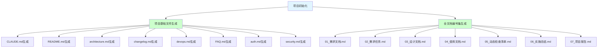
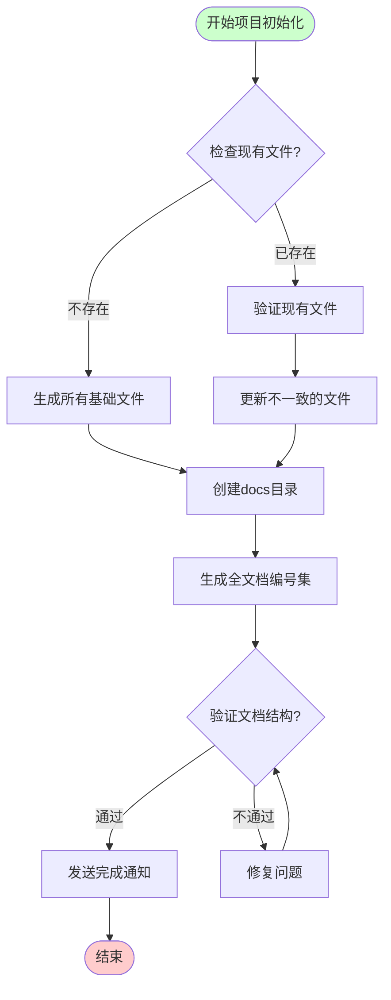
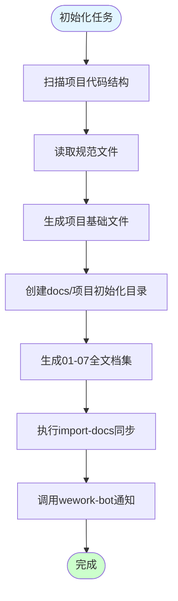
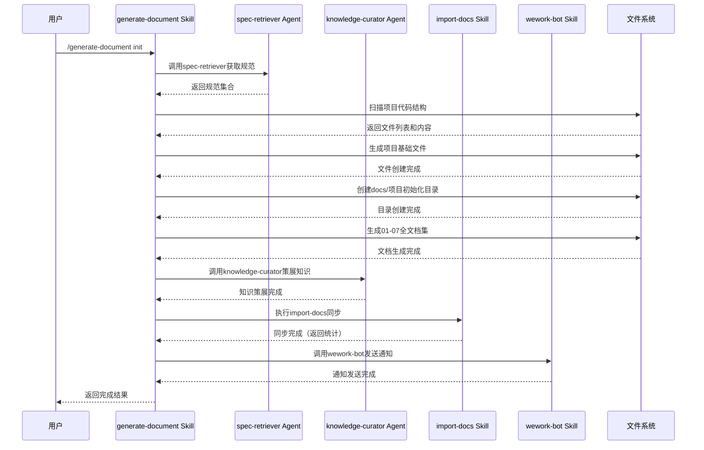

# 项目初始化

> **文档版本**: v1.0 | **最后更新**: 2026-04-29 | **维护者**: doubao-seed-2-0-code-preview-260215 | **工具**: Claude Code
>
> **关联文档**: [需求文档](../01_需求文档.md) | [设计文档](../03_设计文档.md) | [使用文档](../04_使用文档.md)
>

[功能概述](#功能概述) | [功能分析](#功能分析) | [功能详情](#功能详情) | [验收标准](#验收标准) | [使用场景示例](#使用场景示例)

---

## 功能概述

项目初始化需求任务的目标是细化项目初始化的功能需求，包括项目基础文件生成和全文档编号集生成。通过明确的功能分解和操作场景定义，为后续设计文档和实施提供指导。🎯

**核心价值点**：
- 🎯 明确项目初始化的功能范围和操作流程
- ⚡ 定义可验证的验收标准和操作场景
- 📖 为设计文档和实施提供清晰的依据

## 功能分析

### 功能分解图

**说明**：功能分解图展示了项目初始化包含的两个主要功能模块，以及每个模块下的具体文件生成任务。

### 用户流程图

**说明**：用户流程图展示了执行项目初始化的完整操作流程，包括文件检查、生成/更新、验证和通知等环节。

### 功能流程图

**说明**：功能流程图展示了项目初始化的内部处理流程，从代码扫描到文档同步和通知的完整过程。

### 完整时序图

**说明**：完整时序图展示了项目初始化过程中各组件之间的交互时序，包括用户、skill、agent 和文件系统之间的协作。

## 用户故事表格

| 用户故事 | 验收标准 | 过程生成文档 | 产出智能文档 |
|----------|----------|--------|----------|
| 🔴 作为项目维护者，我想要建立项目基础文件体系，以便所有开发者有统一的规范参考  **主要操作场景**： - 新开发者加入项目，阅读 CLAUDE.md、README.md 了解项目 - 开发新功能时，参考 docs/architecture.md 的架构约定 - 遇到问题时，查阅 docs/FAQ.md 寻求解决方案 | 1. CLAUDE.md 存在且包含技术栈、项目结构、编码规范 2. README.md 存在且包含项目简介、快速开始、目录结构 3. docs/architecture.md 存在且包含架构约定和编码规范 4. docs/changelog.md 存在且记录版本变更 5. docs/devops.md 存在且包含构建部署流程 6. docs/FAQ.md 存在且包含常见问题 7. docs/auth.md 存在且包含认证方案 8. docs/security.md 存在且包含安全策略 | [项目初始化-需求任务](../02_需求任务.md) [项目初始化-设计文档](../03_设计文档.md) [项目初始化-项目报告](../07_项目报告.md) | [generate-document 规范](../../.claude/skills/generate-document/rules/项目基础文件.md) [需求文档规范](../../.claude/skills/generate-document/rules/需求文档.md) [需求任务规范](../../.claude/skills/generate-document/rules/需求任务.md) [设计文档规范](../../.claude/skills/generate-document/rules/设计文档.md) |
| 🟡 作为文档维护者，我想要建立全文档编号集模板，以便后续功能开发时有完整的文档结构参考  **主要操作场景**： - 为新功能生成 01-07 全文档集 - 参考已有文档结构生成新文档 - 确保文档间的关联和一致性 | 1. docs/项目初始化/01_需求文档.md 存在 2. docs/项目初始化/02_需求任务.md 存在 3. docs/项目初始化/03_设计文档.md 存在 4. docs/项目初始化/04_使用文档.md 存在 5. docs/项目初始化/05_动态检查清单.md 存在 6. docs/项目初始化/06_实施总结.md 存在 7. docs/项目初始化/07_项目报告.md 存在 | [项目初始化-需求任务](../02_需求任务.md) [项目初始化-设计文档](../03_设计文档.md) [项目初始化-项目报告](../07_项目报告.md) | [generate-document 规范](../../.claude/skills/generate-document/rules/项目基础文件.md) [通用文档规范](../../.claude/skills/generate-document/rules/通用文档.md) |
| 🟢 作为开发者，我想要完整的项目文档体系，以便快速了解项目架构和编码规范  **主要操作场景**： - 查阅项目架构约定文档 - 参考编码规范进行开发 - 查看变更日志了解项目历史 | 1. 文档结构清晰，易于查找 2. 文档内容与实际代码一致 3. 文档有明确的版本和更新记录 | [项目初始化-需求任务](../02_需求任务.md) [项目初始化-设计文档](../03_设计文档.md) [项目初始化-项目报告](../07_项目报告.md) | [使用文档规范](../../.claude/skills/generate-document/rules/使用文档.md) |

## 主要操作场景定义

#### 🎯 主要操作场景：新开发者加入项目

**场景描述**：新开发者加入项目，通过阅读项目文档快速了解项目结构和规范

**前置条件**：
- 项目已克隆到本地
- 项目基础文件已创建

**操作步骤**：
1. 打开 README.md，阅读项目简介和快速开始
2. 打开 CLAUDE.md，了解技术栈和编码规范
3. 打开 docs/architecture.md，学习项目架构约定

**预期结果**：
- 新开发者了解项目的基本情况
- 知道如何配置开发环境
- 了解项目的编码规范和架构模式

**验证关注点**：
- 文档链接是否有效
- 文档内容是否与实际项目一致
- 是否有足够的信息让新开发者上手

**相关设计文档章节**：[架构设计](../03_设计文档.md#架构设计)

---

#### 🎯 主要操作场景：生成新功能文档

**场景描述**：使用项目初始化生成的文档结构作为模板，为新功能生成完整的文档集

**前置条件**：
- docs/项目初始化/ 全文档集已创建
- 已有明确的功能需求

**操作步骤**：
1. 参考 docs/项目初始化/ 下的文档结构
2. 执行 /generate-document 功能名-描述 命令
3. 检查生成的文档是否完整
4. 根据实际情况补充文档内容

**预期结果**：
- 新功能的 docs/功能名/ 目录创建完成
- 01-07 文档完整生成
- 文档间关联链接正确

**验证关注点**：
- 文档结构是否符合规范
- 文档内容是否基于实际代码
- 文档间链接是否有效

**相关设计文档章节**：[实现细节](../03_设计文档.md#实现细节)

---

#### 🎯 主要操作场景：文档同步和通知

**场景描述**：在项目初始化完成后，执行文档同步并发送完成通知

**前置条件**：
- 所有项目基础文件已创建
- docs/项目初始化/ 全文档集已生成

**操作步骤**：
1. 执行 import-docs 同步文档到远端
2. 检查同步结果统计
3. 调用 wework-bot 发送完成通知
4. 确认通知发送成功

**预期结果**：
- 文档同步完成，有真实的创建/覆盖/失败统计
- 企业微信通知发送成功
- 通知内容包含完整的完成信息

**验证关注点**：
- import-docs 是否正确执行
- 通知内容是否符合规范
- 是否包含真实的同步统计

**相关设计文档章节**：[主要操作场景实现](../03_设计文档.md#主要操作场景实现)

---

#### 🎯 主要操作场景：查阅项目架构和规范

**场景描述**：开发者在开发过程中查阅项目架构约定和编码规范文档

**前置条件**：
- docs/architecture.md 已创建
- CLAUDE.md 已创建

**操作步骤**：
1. 打开 docs/architecture.md 查看架构约定
2. 打开 CLAUDE.md 查看编码规范
3. 根据文档指导进行开发

**预期结果**：
- 能够快速找到需要的架构信息
- 编码规范清晰易懂
- 文档内容与实际项目一致

**验证关注点**：
- 架构约定是否覆盖核心模式
- 编码规范是否与实际代码一致
- 文档是否易于查阅

**相关设计文档章节**：[架构设计](../03_设计文档.md#架构设计)

## 影响分析

### 搜索词与改动点清单

| 改动点 | 类型 | 搜索词 | 来源 | 备注 |
|--------|------|--------|------|------|
| `docs/` 目录 | config / directory | `docs`, `documentation` | 需求文档 / 项目结构 | 新增文档目录 |
| `CLAUDE.md` | config / doc | `CLAUDE.md` | 需求文档 / 根目录 | 更新项目规范文件 |
| `README.md` | doc | `README.md` | 需求文档 / 根目录 | 更新项目说明文件 |
| `generate-document` | skill | `generate-document`, `.claude/skills/generate-document/` | 需求文档 / 技能目录 | 用于生成文档的技能 |
| `import-docs` | skill | `import-docs`, `.claude/skills/import-docs/` | 需求文档 / 技能目录 | 用于同步文档的技能 |
| `wework-bot` | skill | `wework-bot`, `.claude/skills/wework-bot/` | 需求文档 / 技能目录 | 用于发送通知的技能 |

### 改动点影响链

| 改动点 | 搜索词 | 命中文件 | 引用方式 | 影响层级 | 依赖方向 | 处置方式 | 闭合状态 | 说明 |
|--------|--------|----------|----------|----------|----------|----------|------|
| `docs/` 目录 | `docs` | `manifest.json` | 未找到 | 直接 | N/A | 无需处理 | 已闭合 | 新增目录，不影响现有代码 |
| `CLAUDE.md` | `CLAUDE.md` | `README.md:L56` | 文档引用 | 二级 | 反向依赖 | 保持兼容 | 已闭合 | README 引用 CLAUDE.md |
| `generate-document` | `generate-document` | `.claude/skills/generate-document/SKILL.md:L1` | skill 定义 | 直接 | N/A | 无需处理 | 已闭合 | skill 已存在 |
| `import-docs` | `import-docs` | `.claude/skills/import-docs/SKILL.md:L1` | skill 定义 | 直接 | N/A | 无需处理 | 已闭合 | skill 已存在 |
| `wework-bot` | `wework-bot` | `.claude/skills/wework-bot/SKILL.md:L1` | skill 定义 | 直接 | N/A | 无需处理 | 已闭合 | skill 已存在 |

### 依赖闭合摘要

| 改动点 | 上游依赖是否核对 | 反向依赖是否核对 | 传递依赖是否闭合 | 测试 / 文档 / 配置是否覆盖 | 结论 |
|--------|------------------|------------------|------------------|------------|------|
| `docs/` 目录 | 是 | 是 | 是 | 是 | 可实施 |
| `CLAUDE.md` | 是 | 是 | 是 | 是 | 可实施 |
| `README.md` | 是 | 是 | 是 | 是 | 可实施 |
| `generate-document` | 是 | 是 | 是 | 是 | 可实施 |
| `import-docs` | 是 | 是 | 是 | 是 | 可实施 |
| `wework-bot` | 是 | 是 | 是 | 是 | 可实施 |

### 未覆盖风险

| 风险来源 | 原因 | 影响 | 缓解方式 |
|----------|------|------|----------|
| `import-docs` 环境变量 | API_X_TOKEN 可能未配置 | 文档同步可能失败 | 检查环境变量，失败时记录但不阻断 |
| `wework-bot` 配置 | 企业微信 webhook 可能未配置 | 通知可能发送失败 | 检查配置，失败时记录但不阻断 |

### 改动范围汇总

- **需直接修改的文件数**：8 个（项目基础文件）+ 7 个（全文档集）= 15 个
- **需验证兼容性的文件数**：0 个（新增文档，不修改现有代码）
- **需追踪传递影响的文件数**：0 个
- **需人工复核或阻断的风险**：无

## 功能详情

### 项目基础文件生成
**功能说明**：生成项目基础文件，包括 CLAUDE.md、README.md、docs/architecture.md、docs/changelog.md、docs/devops.md、docs/FAQ.md、docs/auth.md、docs/security.md

**价值**：为项目提供统一的规范和参考文档，降低新成员上手成本

**解决的痛点**：
- 新开发者不知道从何了解项目
- 缺少统一的编码规范导致代码风格不一致
- 缺少架构文档导致理解困难

**收益**：
- 团队协作效率提升
- 新成员上手时间缩短
- 代码风格一致性提高

### 全文档编号集生成
**功能说明**：生成 docs/项目初始化/ 下的 01-07 全文档编号集，作为后续功能文档的模板和参考

**价值**：为后续功能开发提供完整的文档结构模板和参考示例

**解决的痛点**：
- 每次生成新功能文档时从零开始
- 文档结构不一致导致难以维护
- 缺少文档间关联的统一规范

**收益**：
- 文档生成效率提升
- 文档结构一致性提高
- 文档维护成本降低

## 验收标准

### P0 - 必须通过
- 项目基础文件（CLAUDE.md、README.md、docs/architecture.md、docs/changelog.md、docs/devops.md、docs/FAQ.md、docs/auth.md、docs/security.md）全部创建完成
- docs/项目初始化/ 目录下 01-07 全文档编号集全部创建完成
- 所有文档内容基于实际项目代码和结构，无虚构内容
- 文档头部包含版本、日期、维护者等信息

### P1 - 应该通过
- 文档间的关联链接正确有效
- 文档结构符合规范要求
- Mermaid 图表正确渲染
- 影响分析完整覆盖搜索词和改动点

### P2 - 可以有
- 文档内容详尽，覆盖更多使用场景
- 提供更多最佳实践建议
- 文档格式美观易读

## 使用场景示例

### 📋 场景1：新开发者加入项目
**背景**：新开发者加入团队，需要快速了解 YiPet 项目的基本情况

**操作**：
1. 打开 README.md 阅读项目简介
2. 按照快速开始指南加载扩展到 Chrome
3. 阅读 CLAUDE.md 了解技术栈和编码规范
4. 查阅 docs/architecture.md 了解项目架构

**结果**：新开发者能够在 30 分钟内了解项目的基本情况，开始上手开发

### 🎨 场景2：生成新功能文档
**背景**：需要为新功能"会话导出"生成完整的文档集

**操作**：
1. 参考 docs/项目初始化/ 下的文档结构
2. 执行 /generate-document 会话导出-导出会话到文件 命令
3. 检查生成的 docs/会话导出/ 目录结构
4. 根据实际情况补充具体内容

**结果**：新功能的 01-07 全文档集完整生成，文档结构符合规范
