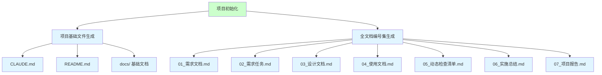
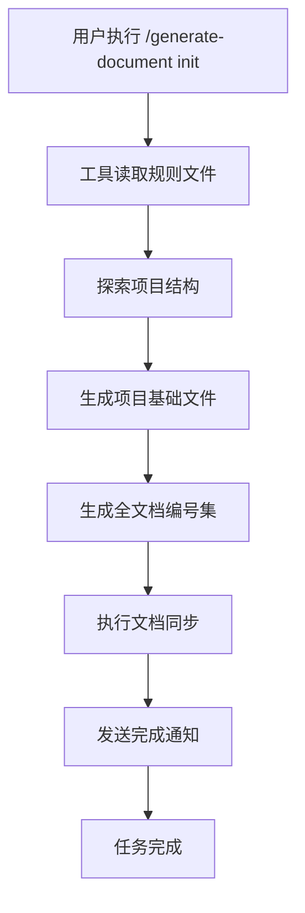
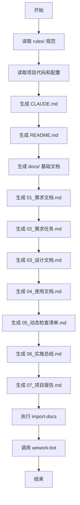
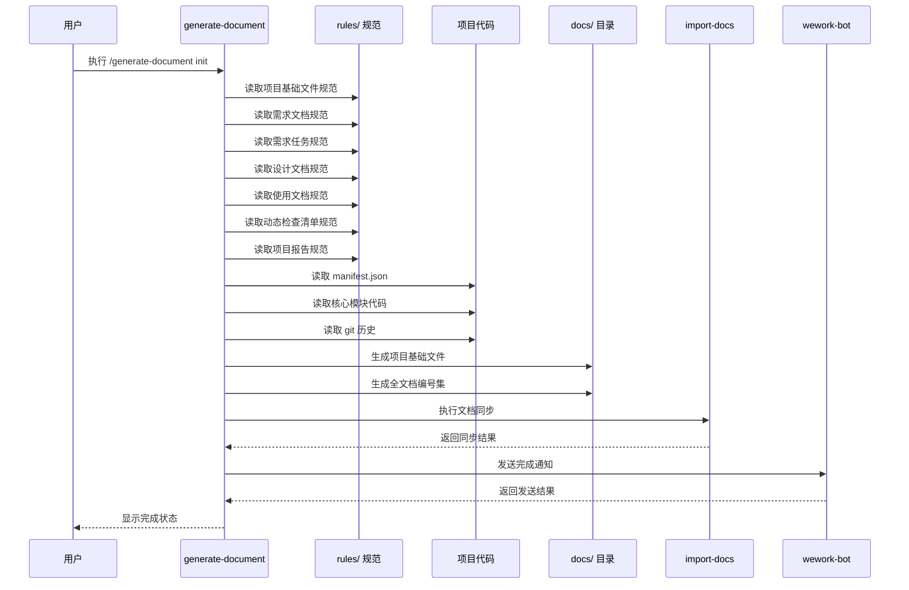

# 项目初始化

> **文档版本**: v1.0 | **最后更新**: 2026-04-28 | **维护者**: doubao-seed-2-0-code-preview-260215 | **工具**: Claude Code
>
> **关联文档**: [需求文档](./01_需求文档.md) | [设计文档](./03_设计文档.md) | [使用文档](./04_使用文档.md)
>
> [功能概述](#功能概述) | [功能分析](#功能分析) | [功能详情](#功能详情) | [验收标准](#验收标准) | [使用场景示例](#使用场景示例)

---

## 功能概述

项目初始化功能通过标准化的文档生成流程，为温柔陪伴助手 Chrome 扩展项目建立完整的文档体系，包括项目基础文件和全文档编号集。通过遵循 rules/ 目录下的规范，确保文档结构的一致性和可维护性。

🎯 建立项目标准文档结构
⚡ 自动化文档生成流程
📖 提供文档生成参考示例

## 功能分析

### 功能分解图

**说明**：功能分解图展示项目初始化的两个核心模块：项目基础文件生成和全文档编号集生成，及其子任务。

### 用户流程图

**说明**：用户流程图展示从执行命令到完成通知的完整用户操作流程。

### 功能流程图

**说明**：功能流程图展示 generate-document 工具的内部处理流程，按依赖顺序生成文档。

### 完整时序图

**说明**：完整时序图展示各组件间的交互顺序和数据流向。

## 用户故事表格

| 用户故事 | 验收标准 | 过程生成文档 | 产出智能文档 |
|----------|----------|--------|----------|
| 🔴 作为开发者，我想要生成项目基础文件，以便快速建立项目文档体系  **主要操作场景**： - 执行 `/generate-document init` 命令 - 查看生成的项目基础文件 - 验证文档链接正确性 | 1. 成功生成 CLAUDE.md 文件 2. 成功生成 README.md 文件 3. 成功生成 docs/ 目录下的架构、变更日志、运维、FAQ、认证、安全文档 4. 所有文档链接使用相对路径且正确 | [项目初始化-基础文件](./02_需求任务.md) | [generate-document Skill](../../.claude/skills/generate-document/SKILL.md) |
| 🔴 作为开发者，我想要生成全文档编号集，以便有完整的需求-设计-验证文档链  **主要操作场景**： - 查看 docs/项目初始化/ 目录下的文档 - 验证文档完整性 - 检查文档间的链接关系 | 1. 成功生成 01_需求文档.md 2. 成功生成 02_需求任务.md 3. 成功生成 03_设计文档.md 4. 成功生成 04_使用文档.md 5. 成功生成 05_动态检查清单.md 6. 成功生成 06_实施总结.md 7. 成功生成 07_项目报告.md 8. 文档间的关联链接正确有效 | [项目初始化-全文档](./02_需求任务.md) | [generate-document Skill](../../.claude/skills/generate-document/SKILL.md) |

## 主要操作场景定义

#### 🎯 主要操作场景：执行 init 命令

**场景描述**：开发者在项目根目录执行 `/generate-document init` 命令，生成项目基础文档。

**前置条件**：
- .claude/skills/generate-document/ 目录存在且包含完整规范
- 项目有基本结构（manifest.json、核心代码等）
- Claude Code 环境可用

**操作步骤**：
1. 打开 Claude Code，进入项目根目录
2. 执行 `/generate-document init` 命令
3. 等待工具完成文档生成
4. 查看生成的文件列表

**预期结果**：
- 在根目录生成/更新 CLAUDE.md 和 README.md
- 在 docs/ 目录生成架构、变更日志、运维、FAQ、认证、安全文档
- 在 docs/项目初始化/ 目录生成 01-07 全文档
- 控制台显示完成状态

**验证关注点**：
- 检查 docs/architecture.md 是否基于项目真实架构
- 检查 docs/changelog.md 是否包含 git 历史
- 检查所有文档链接是否使用相对路径且有效

**相关设计文档章节**：[设计文档-架构设计](./03_设计文档.md#架构设计)

#### 🎯 主要操作场景：验证文档完整性

**场景描述**：开发者检查生成的文档是否完整、链接是否正确。

**前置条件**：
- `/generate-document init` 已执行完成
- 所有文档文件已生成

**操作步骤**：
1. 查看 docs/ 目录下的文件列表
2. 查看 docs/项目初始化/ 目录下的文件列表
3. 点击文档中的关联链接验证有效性
4. 检查文档内容是否基于实际代码

**预期结果**：
- 8 个项目基础文件全部存在
- 7 个全文档编号集全部存在
- 文档间的关联链接可正常跳转
- 文档内容与项目实际情况一致

**验证关注点**：
- 检查 docs/项目初始化/ 目录下是否有 01-07 文档
- 检查文档头部的版本信息是否完整
- 检查文档中的文件路径是否真实存在

**相关设计文档章节**：[设计文档-验证结果](./03_设计文档.md#验证结果)

## 影响分析

### 搜索词与改动点清单

| 改动点 | 类型 | 搜索词 | 来源 | 备注 |
|--------|------|--------|------|------|
| `CLAUDE.md` | config | `CLAUDE.md` | manifest.json / 需求文档 | 项目行为准则入口 |
| `README.md` | doc | `README.md` | manifest.json / 需求文档 | 项目说明文档 |
| `docs/architecture.md` | doc | `architecture.md` | 核心代码 / 需求文档 | 项目架构约定 |
| `docs/changelog.md` | doc | `changelog.md` | git log / 需求文档 | 变更日志 |
| `docs/devops.md` | doc | `devops.md` | 需求文档 | 构建运维文档 |
| `docs/FAQ.md` | doc | `FAQ.md` | 需求文档 | 常见问题文档 |
| `docs/auth.md` | doc | `auth.md` | 需求文档 | 认证鉴权文档 |
| `docs/security.md` | doc | `security.md` | 需求文档 | 安全策略文档 |
| `docs/项目初始化/` | doc | `项目初始化` | 需求文档 | 全文档编号集目录 |

### 改动点影响链

| 改动点 | 搜索词 | 命中文件 | 引用方式 | 影响层级 | 依赖方向 | 处置方式 | 闭合状态 | 说明 |
|--------|--------|----------|----------|----------|----------|----------|----------|
| `CLAUDE.md` | `CLAUDE.md` | `CLAUDE.md` | 直接文件 | 直接 | N/A | 覆盖更新 | 已闭合 | 根目录文件，无反向依赖 |
| `README.md` | `README.md` | `README.md` | 直接文件 | 直接 | N/A | 覆盖更新 | 已闭合 | 根目录文件，无反向依赖 |
| `docs/architecture.md` | `architecture.md` | 未找到引用 | N/A | 直接 | N/A | 新增/覆盖 | 已闭合 | docs/ 目录下新文件 |
| `docs/changelog.md` | `changelog.md` | 未找到引用 | N/A | 直接 | N/A | 新增/覆盖 | 已闭合 | docs/ 目录下新文件 |
| `docs/devops.md` | `devops.md` | 未找到引用 | N/A | 直接 | N/A | 新增/覆盖 | 已闭合 | docs/ 目录下新文件 |
| `docs/FAQ.md` | `FAQ.md` | 未找到引用 | N/A | 直接 | N/A | 新增/覆盖 | 已闭合 | docs/ 目录下新文件 |
| `docs/auth.md` | `auth.md` | 未找到引用 | N/A | 直接 | N/A | 新增/覆盖 | 已闭合 | docs/ 目录下新文件 |
| `docs/security.md` | `security.md` | 未找到引用 | N/A | 直接 | N/A | 新增/覆盖 | 已闭合 | docs/ 目录下新文件 |
| `docs/项目初始化/` | `项目初始化` | 未找到引用 | N/A | 直接 | N/A | 新增目录 | 已闭合 | 新功能文档目录 |

### 依赖闭合摘要

| 改动点 | 上游依赖是否核对 | 反向依赖是否核对 | 传递依赖是否闭合 | 测试 / 文档 / 配置是否覆盖 | 结论 |
|--------|------------------|------------------|------------------|----------------------------|------|
| `CLAUDE.md` | 是 | 是 | 不适用 | 是 | 可实施 |
| `README.md` | 是 | 是 | 不适用 | 是 | 可实施 |
| `docs/architecture.md` | 是 | 是 | 不适用 | 是 | 可实施 |
| `docs/changelog.md` | 是 | 是 | 不适用 | 是 | 可实施 |
| `docs/devops.md` | 是 | 是 | 不适用 | 是 | 可实施 |
| `docs/FAQ.md` | 是 | 是 | 不适用 | 是 | 可实施 |
| `docs/auth.md` | 是 | 是 | 不适用 | 是 | 可实施 |
| `docs/security.md` | 是 | 是 | 不适用 | 是 | 可实施 |
| `docs/项目初始化/` | 是 | 是 | 不适用 | 是 | 可实施 |

### 未覆盖风险

| 风险来源 | 原因 | 影响 | 缓解方式 |
|----------|------|------|----------|
| `import-docs` | 未找到 API_X_TOKEN 环境变量配置 | 文档同步可能失败 | 检查环境变量配置，失败时记录日志不阻断流程 |
| `wework-bot` | 未找到 webhook 配置 | 通知可能发送失败 | 记录失败状态到项目报告，不阻断流程 |

### 改动范围汇总

- **需直接修改的文件数**：8 + 7 = 15 个
- **需验证兼容性的文件数**：0 个（纯文档新增）
- **需追踪传递影响的文件数**：0 个
- **需人工复核或阻断的风险**：import-docs 和 wework-bot 可能因配置缺失失败，但不影响主流程

## 功能详情

### 项目基础文件生成

**功能说明**：根据项目实际代码和配置，生成标准化的项目基础文档。

**价值**：快速建立项目文档标准，减少从零开始的工作，确保文档结构一致性。

**解决的痛点**：每个项目文档结构不一致，新成员难以快速上手，知识沉淀困难。

**收益**：
- 文档结构标准化，便于后续维护
- 新成员可通过文档快速了解项目
- 提升团队协作效率

### 全文档编号集生成

**功能说明**：为项目初始化功能本身生成完整的 01-07 文档链，作为示例参考。

**价值**：展示完整的文档工作流，作为后续功能文档生成的参考模板。

**解决的痛点**：不清楚完整的文档应该包含什么内容，没有示例可参考。

**收益**：
- 提供文档生成的完整示例
- 验证 generate-document 工具的完整性
- 作为后续功能文档的参考模板

## 验收标准

### P0 - 必须通过

- **项目基础文件生成**：CLAUDE.md、README.md、docs/architecture.md、docs/changelog.md、docs/devops.md、docs/FAQ.md、docs/auth.md、docs/security.md 全部成功生成
- **全文档编号集生成**：docs/项目初始化/ 下 01-07 文档全部成功生成
- **文档结构规范**：所有文档遵循 rules/ 目录下的规范要求
- **链接有效性**：所有文档间的关联链接使用相对路径且正确
- **防幻觉要求**：所有技术事实可追溯到代码或上游文档，无来源内容标注"待补充"

### P1 - 应该通过

- **项目描述准确**：README.md 中的项目描述与 manifest.json 一致
- **架构文档详实**：docs/architecture.md 涵盖项目核心架构模式
- **变更日志完整**：docs/changelog.md 包含最近的 git 提交记录
- **FAQ 有针对性**：docs/FAQ.md 包含项目特有问题

### P2 - 可以有

- **认证文档完整**：docs/auth.md 包含认证流程和自检规则
- **安全文档完整**：docs/security.md 包含安全策略和威胁模型
- **文档同步执行**：成功执行 import-docs 同步到 YiAi/YiDocs

## 使用场景示例

### 📋 场景：新项目首次初始化

**背景**：刚创建一个新的 Chrome 扩展项目，需要建立完整的文档体系。

**操作**：
1. 确保项目有基本结构（manifest.json、核心代码目录）
2. 执行 `/generate-document init`
3. 查看生成的文档
4. 根据实际情况调整文档内容

**结果**：
- 项目有了完整的基础文档体系
- 可以开始基于文档模板开发新功能

### 🎨 场景：更新已有项目文档

**背景**：项目已有一段时间，需要更新文档以反映最新架构。

**操作**：
1. 执行 `/generate-document init`
2. 对比新旧文档差异
3. 保留有用的自定义内容
4. 更新文档中的技术事实

**结果**：
- 文档保持最新状态
- 结构保持标准化
