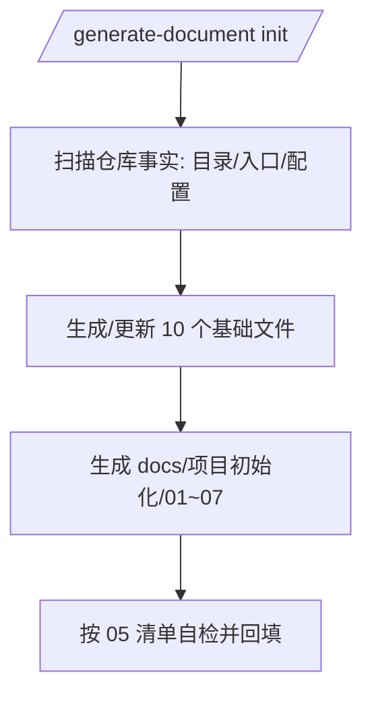

# 项目初始化（设计文档）

> **文档版本**: v1.2 | **最后更新**: 2026-04-29 | **维护者**: gpt-5.2 | **工具**: Cursor
>
> **关联文档**: [需求任务](../02_需求任务.md) | [动态检查清单](../05_动态检查清单.md) | [网络请求](../../network.md) | [状态管理](../../state-management.md)
>

[设计目标](#设计目标) | [设计约束](#设计约束) | [方案概述](#方案概述) | [Grounding 清单](#grounding-清单)

---

## 设计目标

- 建立 `/generate-document init` 的“项目级文档基线”，让后续功能文档（简洁功能名 + 一句话描述）有一致的写法与引用方式。
- 强制证据化：能用代码/配置证明的必须给出路径；不能证明的一律 `> 待补充（原因：...）`。

## 设计约束

- content script **禁止 ES modules**（见 `CLAUDE.md`），因此“入口/加载顺序/全局挂载”是文档必须解释清楚的事实。
- `import-docs` / `wework-bot` 依赖环境配置；在缺证据时不能写“已同步/已通知”。

## 方案概述

### 产物

- **基础文件（10 个）**：`CLAUDE.md`、`README.md`、`docs/{architecture,changelog,devops,network,state-management,FAQ,auth,security}.md`
- **编号集（7 个）**：`docs/项目初始化/01~07`

### 生成与自检闭环（1 张图）

## Grounding 清单

- **入口与顺序**：`manifest.json`、`core/bootstrap/bootstrap.js`、`core/bootstrap/index.js`
- **配置中心**：`core/config.js`、`core/constants/endpoints.js`
- **网络封装**：`core/utils/api/request.js`、`core/api/core/ApiManager.js`、`core/utils/api/token.js`、`core/utils/api/error.js`
- **状态与持久化**：`modules/pet/content/petManager.state.js`、`core/bootstrap/bootstrap.js`、`modules/pet/components/chat/ChatWindow/hooks/*`
