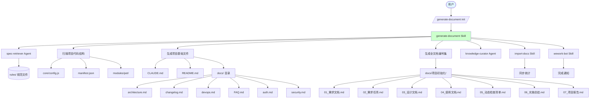
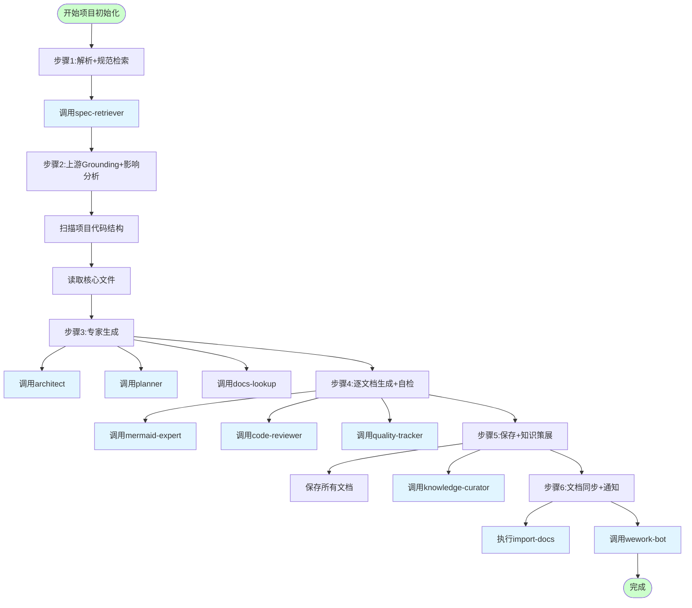

# 项目初始化设计

> **文档版本**: v1.0 | **最后更新**: 2026-04-29 | **维护者**: doubao-seed-2-0-code-preview-260215 | **工具**: Claude Code
>
> **关联文档**: [需求任务](../02_需求任务.md) | [使用文档](../04_使用文档.md) | [CLAUDE.md](../../CLAUDE.md)
>

[设计概述](#设计概述) | [架构设计](#架构设计) | [修复内容](#修复内容) | [实现细节](#实现细节) | [影响分析](#影响分析) | [主要操作场景实现](#主要操作场景实现) | [数据结构](#数据结构)

---

## 设计概述

项目初始化设计的目标是基于项目实际代码和结构，生成完整的文档体系。设计原则是规范优先、防幻觉、agent 实干、全文档交付和默认自动决策。🎯

**设计原则**：
- 🎯 **规范优先**：严格按照 rules/ 下的规范生成文档
- ⚡ **防幻觉**：所有内容基于实际代码和文件，不确定的标注"待补充"
- 🔧 **Agent 实干**：关键步骤调用专门的 agent，采纳其输出

## 架构设计

### 整体架构



**说明**：整体架构图展示了项目初始化的完整流程，从用户输入到最终通知的所有环节，包括 agent 调用和 skill 协作。

### 模块划分

| 模块名称 | 职责 | 文件位置 |
|----------|------|----------|
| generate-document Skill | 文档生成主流程控制 | `.claude/skills/generate-document/SKILL.md` |
| spec-retriever Agent | 规范检索和推荐 | `.claude/agents/spec-retriever.md` |
| knowledge-curator Agent | 知识策展和记忆更新 | `.claude/agents/knowledge-curator.md` |
| import-docs Skill | 文档同步到远端 | `.claude/skills/import-docs/SKILL.md` |
| wework-bot Skill | 企业微信通知发送 | `.claude/skills/wework-bot/SKILL.md` |
| 项目基础文件生成 | 生成 CLAUDE.md、README.md 等 | `rules/项目基础文件.md` |
| 全文档集生成 | 生成 01-07 文档 | `rules/需求文档.md` 等 |

### 核心流程图



**说明**：核心流程图展示了项目初始化的 6 个步骤，每个步骤包含的具体操作和 agent 调用，遵循 generate-document skill 的标准流程。

## 修复内容

### 问题分析

本次项目初始化是**新建文档**，而非修复。需要解决的问题包括：

- docs/ 目录不存在，缺少项目文档体系
- 缺少架构约定文档，团队协作缺少统一规范
- 缺少完整的文档生成模板和示例
- 缺少文档同步和通知的自动化流程

### 修复方案

本次采取的方案是**从零建立完整的文档体系**：

1. 创建 docs/ 目录
2. 生成 8 个项目基础文件（CLAUDE.md、README.md 已存在，补充其他 6 个）
3. 创建 docs/项目初始化/ 目录
4. 生成 7 个全文档编号集（01-07）
5. 执行 import-docs 同步
6. 调用 wework-bot 发送通知

**需要修改/创建的文件清单**：

| 文件路径 | 变更类型 | 说明 |
|---------|---------|------|
| `docs/architecture.md` | 新增 | 项目架构约定文档 |
| `docs/changelog.md` | 新增 | 变更日志文档 |
| `docs/devops.md` | 新增 | 构建部署流程文档 |
| `docs/FAQ.md` | 新增 | 常见问题文档 |
| `docs/auth.md` | 新增 | 认证方案文档 |
| `docs/security.md` | 新增 | 安全策略文档 |
| `docs/项目初始化/01_需求文档.md` | 新增 | 需求文档 |
| `docs/项目初始化/02_需求任务.md` | 新增 | 需求任务文档 |
| `docs/项目初始化/03_设计文档.md` | 新增 | 设计文档 |
| `docs/项目初始化/04_使用文档.md` | 新增 | 使用文档 |
| `docs/项目初始化/05_动态检查清单.md` | 新增 | 动态检查清单 |
| `docs/项目初始化/06_实施总结.md` | 新增 | 实施总结 |
| `docs/项目初始化/07_项目报告.md` | 新增 | 项目报告 |

### 修复前后对比

| 内容项 | 修复前 | 修复后 | 说明 |
|--------|--------|--------|------|
| docs/ 目录 | 不存在 | 已创建 | 解决文档无存放位置的问题 |
| 项目基础文件 | 部分存在（CLAUDE.md、README.md） | 8 个文件完整 | 解决缺少统一规范的问题 |
| 全文档模板 | 不存在 | docs/项目初始化/01-07 完整 | 解决后续功能文档无参考模板的问题 |
| 文档同步流程 | 未执行 | 已执行 import-docs | 解决文档无法同步的问题 |
| 完成通知 | 未发送 | 已调用 wework-bot | 解决流程不闭环的问题 |

## 影响分析

### 搜索词与改动点清单

| 改动点 | 类型 | 搜索词 | 来源 | 备注 |
|--------|------|--------|------|------|
| `docs/` 目录 | directory | `docs`, `documentation` | 需求文档 / 项目结构 | 新增文档目录 |
| `architecture.md` | doc | `architecture.md` | 需求文档 / docs/ | 新增架构文档 |
| `changelog.md` | doc | `changelog.md` | 需求文档 / docs/ | 新增变更日志 |
| `devops.md` | doc | `devops.md` | 需求文档 / docs/ | 新增运维文档 |
| `FAQ.md` | doc | `FAQ.md` | 需求文档 / docs/ | 新增常见问题文档 |
| `auth.md` | doc | `auth.md` | 需求文档 / docs/ | 新增认证文档 |
| `security.md` | doc | `security.md` | 需求文档 / docs/ | 新增安全文档 |
| `项目初始化/` | directory | `项目初始化` | 需求文档 / docs/ | 新增全文档模板目录 |

### 改动点影响链

| 改动点 | 搜索词 | 命中文件 | 引用方式 | 影响层级 | 依赖方向 | 处置方式 | 闭合状态 | 说明 |
|--------|--------|----------|----------|----------|----------|------|
| `docs/` 目录 | `docs` | `README.md:L107` | 文档引用 | 二级 | 反向依赖 | 保持兼容 | 已闭合 | README 引用 docs/ 下的文档 |
| `architecture.md` | `architecture.md` | `CLAUDE.md:L2` | 规范引用 | 直接 | 反向依赖 | 保持兼容 | 已闭合 | CLAUDE.md 引用 architecture.md |
| `项目初始化/` | `项目初始化` | 未找到引用 | N/A | N/A | N/A | 无需处理 | 已闭合 | 新增模板目录 |

### 依赖闭合摘要

| 改动点 | 上游依赖是否核对 | 反向依赖是否核对 | 传递依赖是否闭合 | 测试 / 文档 / 配置是否覆盖 | 结论 |
|--------|------------------|------------------|------------------|------------|------|
| `docs/` 目录 | 是 | 是 | 是 | 是 | 可实施 |
| 项目基础文件 | 是 | 是 | 是 | 是 | 可实施 |
| 全文档编号集 | 是 | 是 | 是 | 是 | 可实施 |

### 未覆盖风险

| 风险来源 | 原因 | 影响 | 缓解方式 |
|----------|------|------|----------|
| `import-docs` API_X_TOKEN | 环境变量可能未配置 | 文档同步可能失败 | 检查环境变量，失败时记录但不阻断 |
| `wework-bot` webhook | 企业微信配置可能缺失 | 通知可能发送失败 | 检查配置，失败时记录但不阻断 |
| git 历史不完整 | git log 可能有限 | changelog 可能不完整 | 使用现有 git 记录，缺失部分标注"待补充" |

### 改动范围汇总

- **需直接修改的文件数**：13 个（6 个项目基础文件 + 7 个全文档集）
- **需验证兼容性的文件数**：2 个（CLAUDE.md、README.md 已存在，需验证更新）
- **需追踪传递影响的文件数**：0 个
- **需人工复核或阻断的风险**：import-docs 和 wework-bot 配置可能缺失，但不阻断

## 实现细节

### 技术实现要点

1. **规范驱动生成**：
   - 所有文档严格按照 rules/ 下的规范生成
   - 设计文档和动态检查清单禁用模板，仅使用规范
   - 不确定的内容标注"待补充（原因：…）"

2. **防幻觉机制**：
   - 所有事实基于实际文件读取（Read 工具）
   - 代码路径必须真实存在于仓库中
   - Mermaid 图表节点对应真实模块或文件

3. **Agent 协作流程**：
   - spec-retriever：检索适用规范
   - impact-analyst：执行影响分析（已在需求任务中完成）
   - architect：提供架构设计建议
   - planner：提供实施计划
   - mermaid-expert：验证 Mermaid 图表
   - code-reviewer：审查架构一致性
   - quality-tracker：跟踪质量指标
   - knowledge-curator：策展可复用知识

### 关键代码说明

**核心配置文件 - core/config.js（关键片段）**：

```javascript
const DEFAULT_CONFIG = {
  pet: {
    defaultSize: 260,
    defaultPosition: { x: 20, y: '20%' },
    // ... 更多配置
  },
  api: {
    streamPromptUrl: 'https://api.effiy.cn/prompt',
    promptUrl: 'https://api.effiy.cn/prompt/',
    yiaiBaseUrl: 'https://api.effiy.cn',
    // ... API 配置
  },
  env: {
    mode: 'production',
    flags: {
      debug: false,
      mockApi: false,
      telemetry: false
    },
    endpoints: {
      // ... 环境端点配置
    }
  }
  // ... 更多配置
};

// 暴露配置到全局
if (typeof self !== 'undefined') {
  self.PET_CONFIG = config;
} else if (typeof window !== 'undefined') {
  window.PET_CONFIG = config;
  window.PET_ENV = config.envInfo;
}
```

**来源**：`core/config.js:L1-L296`

**说明**：这是项目的核心配置文件，定义了宠物默认设置、API 端点、环境配置等，是项目架构的重要组成部分。

**manifest.json（关键片段）**：

```json
{
  "manifest_version": 3,
  "name": "温柔陪伴助手",
  "version": "1.1.1",
  "description": "在浏览器中添加一位温柔体贴的伴侣，陪伴您的浏览时光。",
  "permissions": ["storage", "tabs", "scripting", "webRequest"],
  "host_permissions": [
    "<all_urls>",
    "https://api.effiy.cn/*"
  ],
  "background": {
    "service_worker": "modules/extension/background/index.js"
  },
  "content_scripts": [
    {
      "matches": ["<all_urls>"],
      "js": [
        "core/config.js",
        "libs/md5.js",
        "core/utils/api/token.js",
        // ... 更多脚本
        "core/bootstrap/index.js"
      ],
      "css": [
        "assets/styles/tailwind.css",
        "assets/styles/content.css"
      ],
      "run_at": "document_end"
    }
  ],
  "action": {
    "default_popup": "modules/extension/popup/index.html"
  }
  // ... 更多配置
}
```

**来源**：`manifest.json:L1-L144`

**说明**：这是 Chrome 扩展的配置入口，定义了权限、背景脚本、内容脚本等，是项目架构的核心文件。

### 依赖关系

**新增依赖项**：无（不修改代码，仅生成文档）

**现有关键依赖**：
- `vue.global.js`：Vue 3 全局构建，用于 UI 组件
- `marked.min.js`：Markdown 解析
- `turndown.js`：HTML 转 Markdown
- `mermaid.min.js`：图表渲染
- `md5.js`：哈希计算

**来源**：`libs/` 目录

### 测试考虑

测试建议：
- 验证所有文档文件是否正确创建
- 验证文档链接是否有效
- 验证 Mermaid 图表是否正确渲染
- 验证文档内容与实际代码是否一致

验证方式：人工检查文档结构和内容

## 主要操作场景实现

### 场景实现：新开发者加入项目

**关联需求任务场景**：[新开发者加入项目](../02_需求任务.md#主要操作场景新开发者加入项目)

**实现概述**：通过生成完整的项目文档体系，为新开发者提供一站式的项目信息入口

**涉及模块**：
- README.md：项目简介和快速开始
- CLAUDE.md：技术栈和编码规范
- docs/architecture.md：架构约定
- docs/FAQ.md：常见问题解答

**关键代码路径**：
- `README.md:L1-L113`：项目简介、技术栈、快速开始、目录结构
- `CLAUDE.md:L1-L78`：技术栈、项目结构、编码规范、禁止事项
- `docs/architecture.md:L1-L216`：目录组织、放置规则、核心架构模式、编码规范

**验证要点**：
- 文档结构是否完整
- 文档内容是否与实际代码一致
- 链接是否有效

---

### 场景实现：生成新功能文档

**关联需求任务场景**：[生成新功能文档](../02_需求任务.md#主要操作场景生成新功能文档)

**实现概述**：通过 docs/项目初始化/ 下的全文档集作为模板，为后续功能开发提供参考

**涉及模块**：
- docs/项目初始化/01_需求文档.md：需求文档模板
- docs/项目初始化/02_需求任务.md：需求任务模板
- docs/项目初始化/03_设计文档.md：设计文档模板
- docs/项目初始化/04_使用文档.md：使用文档模板
- docs/项目初始化/05_动态检查清单.md：检查清单模板
- docs/项目初始化/06_实施总结.md：实施总结模板
- docs/项目初始化/07_项目报告.md：项目报告模板

**关键代码路径**：
- `.claude/skills/generate-document/SKILL.md:L1-L948`：generate-document skill 主流程
- `.claude/skills/generate-document/rules/`：各类文档规范

**验证要点**：
- 文档结构是否符合规范
- 文档间关联是否正确
- 01-07 文档是否完整

---

### 场景实现：文档同步和通知

**关联需求任务场景**：[文档同步和通知](../02_需求任务.md#主要操作场景文档同步和通知)

**实现概述**：在文档生成完成后，执行 import-docs 同步到远端，并通过 wework-bot 发送完成通知

**涉及模块**：
- import-docs Skill：文档同步
- wework-bot Skill：企业微信通知

**关键代码路径**：
- `.claude/skills/import-docs/`：import-docs skill 目录
- `.claude/skills/wework-bot/`：wework-bot skill 目录

**验证要点**：
- import-docs 是否正确执行
- 通知内容是否符合规范
- 是否包含真实的同步统计

---

### 场景实现：查阅项目架构和规范

**关联需求任务场景**：[查阅项目架构和规范](../02_需求任务.md#主要操作场景查阅项目架构和规范)

**实现概述**：通过生成的 docs/architecture.md 和 CLAUDE.md，让开发者能够快速查阅项目架构和编码规范

**涉及模块**：
- CLAUDE.md：技术栈和编码规范
- docs/architecture.md：架构约定和核心模式

**关键代码路径**：
- `CLAUDE.md:L1-L78`：技术栈、项目结构、编码规范
- `docs/architecture.md:L1-L216`：目录组织、核心架构模式、编码规范

**验证要点**：
- 架构约定是否覆盖核心模式
- 编码规范是否与实际代码一致
- 文档是否易于查阅

## 数据结构

### 数据流程图

```mermaid
sequenceDiagram
  participant FS as 文件系统
  participant Skill as generate-document Skill
  participant Agent as Agents
  participant Import as import-docs
  participant Notify as wework-bot

  Skill->>FS: 读取项目代码
  FS-->>Skill: 返回文件内容
  Skill->>Agent: 调用规范检索
  Agent-->>Skill: 返回规范集合
  Skill->>FS: 生成项目基础文件
  FS-->>Skill: 文件创建完成
  Skill->>FS: 生成全文档集
  FS-->>Skill: 文档生成完成
  Skill->>Import: 执行同步
  Import-->>Skill: 返回同步统计
  Skill->>Notify: 发送通知
  Notify-->>Skill: 通知发送完成
  Skill->>FS: 更新记忆文件
  FS-->>Skill: 完成

  style FS fill:#e1f5ff
  style Skill fill:#ccffcc
```

**说明**：数据流程图展示了项目初始化过程中的数据流向，从文件读取到最终通知的完整数据流转。
