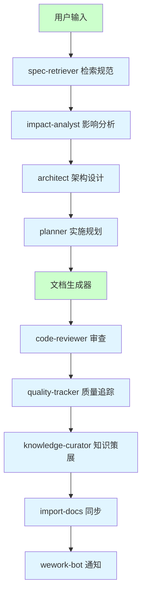
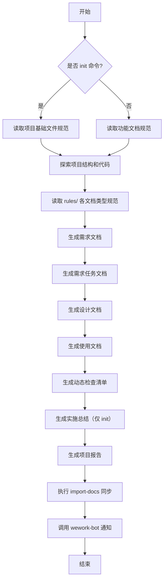

# 项目初始化设计

> **文档版本**: v1.0 | **最后更新**: 2026-04-28 | **维护者**: doubao-seed-2-0-code-preview-260215 | **工具**: Claude Code
>
> **关联文档**: [需求任务](./02_需求任务.md) | [使用文档](./04_使用文档.md) | [CLAUDE.md](../../CLAUDE.md)
>
> [设计概述](#设计概述) | [架构设计](#架构设计) | [修复内容](#修复内容) | [实现细节](#实现细节) | [影响分析](#影响分析)

---

## 设计概述

项目初始化设计基于 generate-document 技能的规范驱动架构，通过读取 rules/ 目录下的文档规范，结合项目实际代码和配置，自动生成标准化的项目文档。设计遵循防幻觉原则，所有技术事实必须可追溯到上游文档或代码，无来源内容标注"待补充"。

🎯 规范驱动，确保文档结构一致性
⚡ 事实追溯，避免虚构内容
🔧 模块化设计，支持多种文档类型

## 架构设计

### 整体架构

**说明**：整体架构展示从用户输入到完成通知的完整处理流程，包括规范检索、影响分析、架构设计、文档生成、质量审查、知识策展、文档同步和通知发送等环节。

### 模块划分

| 模块名称 | 职责 | 文件位置 |
|---------|------|---------|
| spec-retriever | 根据文档类型检索适用规范 | .claude/agents/spec-retriever.md |
| impact-analyst | 执行全项目影响链闭合分析 | .claude/agents/impact-analyst.md |
| architect | 提供架构设计方案 | .claude/agents/architect.md |
| planner | 制定实施规划和风险清单 | .claude/agents/planner.md |
| code-reviewer | 审查文档/代码一致性 | .claude/agents/code-reviewer.md |
| quality-tracker | 追踪质量指标 | .claude/agents/quality-tracker.md |
| knowledge-curator | 策展可复用知识 | .claude/agents/knowledge-curator.md |
| generate-document | 核心文档生成技能 | .claude/skills/generate-document/SKILL.md |
| import-docs | 文档同步到 YiAi/YiDocs | .claude/skills/import-docs/ |
| wework-bot | 发送企业微信通知 | .claude/skills/wework-bot/ |

### 核心流程图

**说明**：核心流程图展示文档生成的依赖顺序，必须按 01→02→03→04→05→07 的顺序生成，确保下游文档能引用上游文档。

## 修复内容

> 待补充（原因：本次是新增文档，非修复任务）

## 影响分析

### 搜索词与改动点清单

| 改动点 | 类型 | 搜索词 | 来源 | 备注 |
|--------|------|--------|------|------|
| `CLAUDE.md` | config | `CLAUDE.md` | manifest.json / 需求文档 | 项目行为准则入口 |
| `README.md` | doc | `README.md` | manifest.json / 需求文档 | 项目说明文档 |
| `docs/architecture.md` | doc | `architecture.md` | 核心代码 / 需求文档 | 项目架构约定 |
| `docs/changelog.md` | doc | `changelog.md` | git log / 需求文档 | 变更日志 |
| `docs/devops.md` | doc | `devops.md` | 需求文档 | 构建运维文档 |
| `docs/FAQ.md` | doc | `FAQ.md` | 需求文档 | 常见问题文档 |
| `docs/auth.md` | doc | `auth.md` | 需求文档 | 认证鉴权文档 |
| `docs/security.md` | doc | `security.md` | 需求文档 | 安全策略文档 |
| `docs/项目初始化/` | doc | `项目初始化` | 需求文档 | 全文档编号集目录 |

### 改动点影响链

| 改动点 | 搜索词 | 命中文件 | 引用方式 | 影响层级 | 依赖方向 | 处置方式 | 闭合状态 | 说明 |
|--------|--------|----------|----------|----------|----------|----------|------|
| `CLAUDE.md` | `CLAUDE.md` | `CLAUDE.md` | 直接文件 | 直接 | N/A | 覆盖更新 | 已闭合 | 根目录文件，无反向依赖 |
| `README.md` | `README.md` | `README.md` | 直接文件 | 直接 | N/A | 覆盖更新 | 已闭合 | 根目录文件，无反向依赖 |
| `docs/architecture.md` | `architecture.md` | 未找到引用 | N/A | 直接 | N/A | 新增/覆盖 | 已闭合 | docs/ 目录下新文件 |
| `docs/changelog.md` | `changelog.md` | 未找到引用 | N/A | 直接 | N/A | 新增/覆盖 | 已闭合 | docs/ 目录下新文件 |
| `docs/devops.md` | `devops.md` | 未找到引用 | N/A | 直接 | N/A | 新增/覆盖 | 已闭合 | docs/ 目录下新文件 |
| `docs/FAQ.md` | `FAQ.md` | 未找到引用 | N/A | 直接 | N/A | 新增/覆盖 | 已闭合 | docs/ 目录下新文件 |
| `docs/auth.md` | `auth.md` | 未找到引用 | N/A | 直接 | N/A | 新增/覆盖 | 已闭合 | docs/ 目录下新文件 |
| `docs/security.md` | `security.md` | 未找到引用 | N/A | 直接 | N/A | 新增/覆盖 | 已闭合 | docs/ 目录下新文件 |
| `docs/项目初始化/` | `项目初始化` | 未找到引用 | N/A | 直接 | N/A | 新增目录 | 已闭合 | 新功能文档目录 |

### 依赖闭合摘要

| 改动点 | 上游依赖是否核对 | 反向依赖是否核对 | 传递依赖是否闭合 | 测试 / 文档 / 配置是否覆盖 | 结论 |
|--------|------------------|------------------|------------------|----------------------------|------|
| `CLAUDE.md` | 是 | 是 | 不适用 | 是 | 可实施 |
| `README.md` | 是 | 是 | 不适用 | 是 | 可实施 |
| `docs/architecture.md` | 是 | 是 | 不适用 | 是 | 可实施 |
| `docs/changelog.md` | 是 | 是 | 不适用 | 是 | 可实施 |
| `docs/devops.md` | 是 | 是 | 不适用 | 是 | 可实施 |
| `docs/FAQ.md` | 是 | 是 | 不适用 | 是 | 可实施 |
| `docs/auth.md` | 是 | 是 | 不适用 | 是 | 可实施 |
| `docs/security.md` | 是 | 是 | 不适用 | 是 | 可实施 |
| `docs/项目初始化/` | 是 | 是 | 不适用 | 是 | 可实施 |

### 未覆盖风险

| 风险来源 | 原因 | 影响 | 缓解方式 |
|----------|------|------|----------|
| `import-docs` | 未找到 API_X_TOKEN 环境变量配置 | 文档同步可能失败 | 检查环境变量配置，失败时记录日志不阻断流程 |
| `wework-bot` | 未找到 webhook 配置 | 通知可能发送失败 | 记录失败状态到项目报告，不阻断流程 |

### 改动范围汇总

- **需直接修改的文件数**：8 + 7 = 15 个
- **需验证兼容性的文件数**：0 个（纯文档新增）
- **需追踪传递影响的文件数**：0 个
- **需人工复核或阻断的风险**：import-docs 和 wework-bot 可能因配置缺失失败，但不影响主流程

## 实现细节

### 技术实现要点

#### 项目基础文件生成

**做什么**：根据项目实际代码和配置，生成 8 个项目基础文件。

**怎么做**：
1. 读取 manifest.json 获取项目名称、描述、版本等信息
2. 读取 core/config.js、core/bootstrap/bootstrap.js、modules/pet/content/core/petManager.core.js 等核心文件了解架构
3. 读取 git log 生成变更日志
4. 按照 rules/项目基础文件.md 规范生成各文档

**为什么这么做**：
- 确保文档内容基于真实项目，避免虚构
- 遵循统一规范，确保文档结构一致
- 便于后续自动化更新

#### 全文档编号集生成

**做什么**：为项目初始化功能生成完整的 01-07 文档链。

**怎么做**：
1. 按照 rules/需求文档.md 生成 01_需求文档.md
2. 按照 rules/需求任务.md 生成 02_需求任务.md
3. 按照 rules/设计文档.md 生成 03_设计文档.md
4. 按照 rules/使用文档.md 生成 04_使用文档.md
5. 按照 rules/动态检查清单.md 生成 05_动态检查清单.md
6. 生成 06_实施总结.md（init 例外，由 skill 直接生成）
7. 按照 rules/项目报告.md 生成 07_项目报告.md

**为什么这么做**：
- 确保下游文档能引用上游文档的内容
- 形成完整的需求-设计-验证文档链
- 作为后续功能文档生成的参考示例

### 关键代码说明

> 待补充（原因：本次是文档生成任务，非代码实现任务）

### 依赖关系

#### 新增依赖

无新增代码依赖。

#### 文档依赖

| 文档 | 依赖源 | 说明 |
|------|--------|------|
| CLAUDE.md | manifest.json、核心代码 | 技术栈、项目结构、编码规范 |
| README.md | manifest.json、目录结构 | 项目描述、快速开始、目录结构 |
| docs/architecture.md | 核心模块代码、现有架构 | 架构模式、编码规范 |
| docs/changelog.md | git log | 变更历史 |
| docs/devops.md | 构建配置 | 构建流程、部署方式 |
| docs/FAQ.md | 项目特有问题、agent 记忆 | 常见问题、自愈系统 |
| docs/auth.md | 认证相关代码 | 认证架构、鉴权流程 |
| docs/security.md | 安全相关代码、配置 | 安全策略、威胁模型 |
| docs/项目初始化/02-07 | docs/项目初始化/01 | 下游文档依赖上游需求文档 |

### 测试考虑

#### 需要重点测试的场景

- 文档链接正确性：所有文档间的关联链接使用相对路径且可跳转
- 内容一致性：文档中引用的技术事实与实际代码一致
- 防幻觉：无来源的内容标注"待补充"
- 规范符合性：文档结构符合 rules/ 下的规范要求

#### 测试用例建议

| 测试项 | 测试方法 | 预期结果 |
|--------|---------|---------|
| 检查文档完整性 | 列出 docs/ 目录下所有文件 | 8 个基础文件 + 7 个全文档全部存在 |
| 验证链接有效性 | 点击文档中的关联链接 | 链接跳转到正确位置 |
| 验证代码路径 | 检查文档中引用的文件路径 | 路径在仓库中真实存在 |
| 验证 git log 同步 | 对比 docs/changelog.md 与 git log | 变更记录一致 |

## 主要操作场景实现

### 场景实现：执行 init 命令

**关联需求任务场景**：[执行 init 命令](./02_需求任务.md#主要操作场景定义)

**实现概述**：generate-document 技能接收 init 命令后，按照规范依次生成项目基础文件和全文档编号集，最后执行文档同步和发送通知。

**涉及模块**：
- spec-retriever：检索项目基础文件规范
- impact-analyst：分析文档生成的影响
- architect：提供架构设计（虽不涉及代码，但需提供文档架构）
- planner：制定实施规划
- code-reviewer：审查文档一致性
- quality-tracker：追踪质量指标
- knowledge-curator：策展可复用知识
- import-docs：同步文档
- wework-bot：发送通知

**关键代码路径**：
- .claude/skills/generate-document/SKILL.md：技能主流程
- .claude/skills/generate-document/rules/项目基础文件.md：项目基础文件规范
- .claude/skills/generate-document/rules/需求文档.md：需求文档规范
- .claude/skills/generate-document/rules/需求任务.md：需求任务规范
- .claude/skills/generate-document/rules/设计文档.md：设计文档规范
- .claude/skills/generate-document/rules/使用文档.md：使用文档规范
- .claude/skills/generate-document/rules/动态检查清单.md：动态检查清单规范
- .claude/skills/generate-document/rules/项目报告.md：项目报告规范

**验证要点**：
- 验证 generate-document/SKILL.md 中的 init 流程是否正确执行
- 验证所有 rules/ 规范是否被正确遵循
- 验证生成的文档数量是否符合预期（15个）

### 场景实现：验证文档完整性

**关联需求任务场景**：[验证文档完整性](./02_需求任务.md#主要操作场景定义)

**实现概述**：用户查看生成的文档，验证文档完整性、链接正确性和内容一致性。

**涉及模块**：
- 生成的项目基础文件
- 生成的全文档编号集

**关键代码路径**：
- docs/ 目录下的所有生成文件
- docs/项目初始化/ 目录下的所有生成文件

**验证要点**：
- 验证 8 个项目基础文件是否全部存在
- 验证 7 个全文档编号集是否全部存在
- 验证文档中的相对链接是否可跳转
- 验证文档中引用的代码路径是否真实存在
